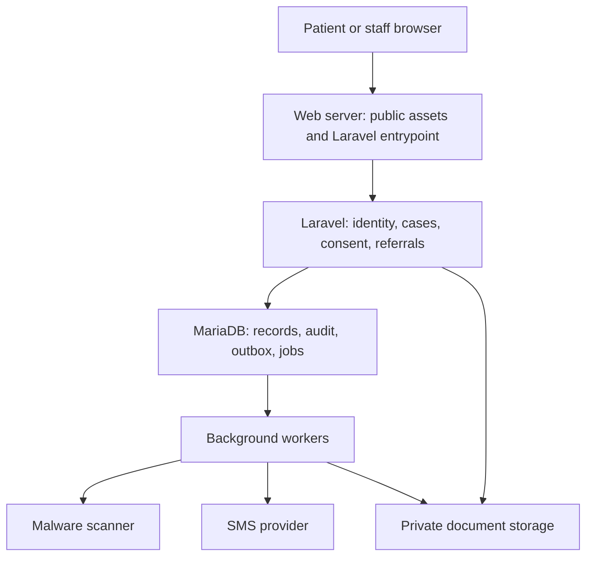
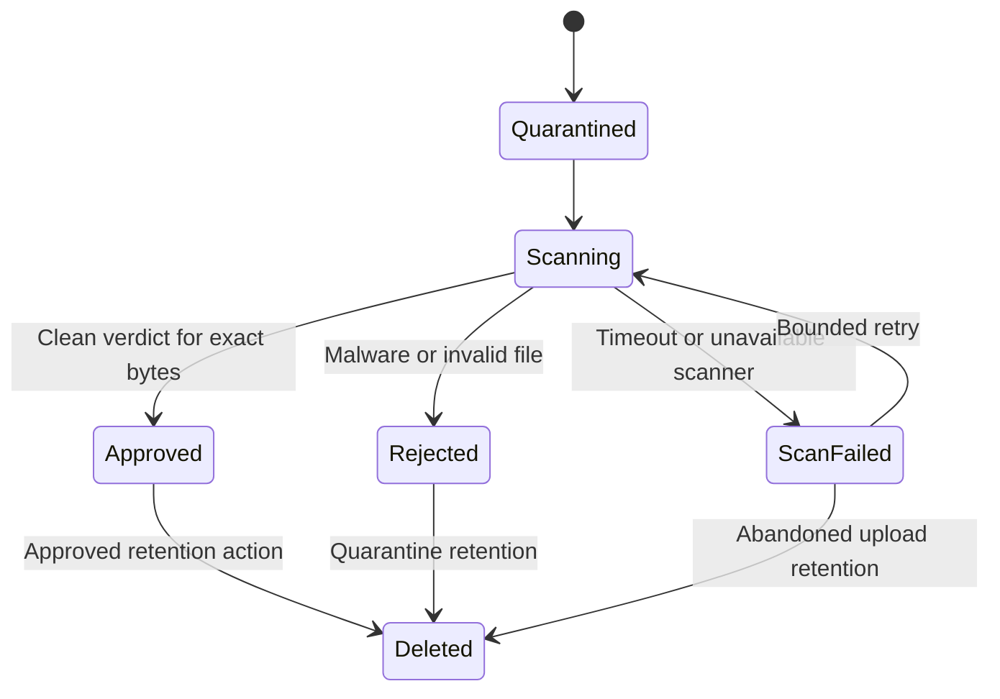

# Royadarman — architecture review and backend plan

Review date: 7 September 2026. Proposed revision: v3, extending the v2 architecture described in the shared conversation.

**Decision:** retain a Laravel modular monolith with MariaDB for the MVP. Retain AlmaLinux/cPanel only if operational checks below pass. Make Persian, Arabic and English first-class application languages from the next implementation phase. Keep live patient intake disabled until the security and operational gates pass. The visual identity remains pending client approval through Majnouni.

**Evidence and limits**

I read the complete accessible shared conversation, including the beginning, implementation checkpoints, redesign request and final pause. Its serialized timeline contains 566 entries, including empty entries and redacted tool results. The project is a dental patient-support and referral service with Tehran-only home dentistry. The owner is not a dentist; clinical opinions must be attributable to licensed clinicians.

The shared chat reports an architecture document, frontend source, backend overlay and deployed files. Those files are not attached in this conversation, and their contents are not recoverable from the redacted tool outputs. This is therefore a review of the documented design and implementation claims, not certification of the code or infrastructure. I have not rerun the reported tests. A fresh public HTTP request to royadarman.com returned 502 from this environment; that does not establish whether the origin itself is down.

Source conversation: https://chatgpt.com/share/6a9ee168-cfc8-83ea-9a89-5af555f86f95

**1. Reconstructed current state**

| Area | Evidence in the chat | Review conclusion |
|---|---|---|
| Product | 24-hour support/coordination, home dentistry in Tehran, OPG review and budget-aware referrals | Preserve; separate advertised contact availability from clinical response times |
| Public frontend | Corrected Persian static frontend reportedly deployed; green/teal identity | Treat as last reported production state, not freshly verified |
| Legacy product | 50-screen patient/clinic/operations concept retained at `/demo/` | Archived reference only; do not import its marketplace scope into MVP |
| Framework | Laravel 13 application reportedly created outside `public_html` | Sensible baseline; inspect complete application and lockfile |
| Runtime | Initial PHP 8.2 report, later PHP 8.3.33 reported available | Resolve CLI, web/FPM and worker runtimes independently |
| Database | MariaDB 10.11 reported | Retain subject to patch, engine, schema and restore checks |
| Backend foundation | Disabled intake, state machines, encrypted contact fields, consent, assignments and audit records | Useful reported foundation; enforcement remains unverified |
| OPG pipeline | Private quarantine, validation, scanner job, clean promotion, unavailable-scanner failure handling | Good intended pattern; actual scanner operation and file authorization are unfinished |
| Tests | 8 tests/24 assertions, later 11 tests/35 assertions | Historical foundation evidence, not sufficient release coverage |
| Frontend QA | Syntax, DOM smoke tests, deployment hashes and automated design audit reported | Browser rendering/accessibility proof incomplete; TinyFish result still pending in the chat |
| Branding | Three original directions reportedly created and sent through Majnouni | Exact images/option mapping unavailable; no selected direction established |
| Last state | Paused awaiting client approval; isolated intake still disabled | Planning can proceed; do not infer approval to deploy the redesign |
| Memory | Engram/Create State reportedly updated; handoff `25241dd6-adf6-427f-9b28-d6e5d3deb0a2` | Historical reference; no new memory-sync claim in this review |

Important corrections to the earlier reasoning: `/wp-json/` returning 404 alone cannot prove WordPress is absent, although the reported source inspection offers stronger evidence. A directory outside the web root reduces exposure but does not itself provide encryption, access control or account isolation. A disabled button does not disable an API. `robots.txt` and `noindex` do not secure a preview. A test count, DOM simulation or zero-findings design audit does not prove real browser accessibility or clinical-data security.

**2. Architecture decisions**

| Decision | Recommendation | Condition or rationale |
|---|---|---|
| Application shape | One modular Laravel application | Clear domain boundaries without distributed-service overhead |
| Laravel | Retain 13.x; pin resolved dependencies in `composer.lock` | Official support policy lists PHP 8.3–8.5 and security support through 17 March 2028 [S1] |
| PHP | Keep patched 8.3 initially if that is the proven runtime; test a move to 8.5 before standardizing | PHP 8.3 is security-only through end-2027; 8.5 has a longer support runway. Host and dependency compatibility must be proven [S2] |
| Host | Conditional approval for existing AlmaLinux/cPanel | Must support supervised workers, scanner updates, private storage, encrypted off-host backups and monitoring |
| Database | Keep MariaDB; use InnoDB, foreign keys and `utf8mb4` | No demonstrated requirement for a database migration |
| Queues | Database-backed queues initially | Separate scanning and notification capacity; adopt Redis only when measured load warrants it |
| Public rendering | Locale-aware server-rendered Blade pages with progressive enhancement | Reuse existing CSS, SVG and useful JavaScript; avoid a frontend rewrite merely for localization |
| Authenticated UI | Same-origin patient and staff routes | Secure cookies and server policies; avoid introducing cross-origin auth complexity for this MVP |
| CMS | Version-controlled content/translation files initially | Add an editorial UI later only if operationally needed; no WordPress dependency for intake |
| Files | Private quarantine and approved storage with authenticated access | No public upload directory, storage link or unguarded document URL |
| External services | SMS delivery and monitored malware scanning | Verify actual availability, permitted use and delivery in the intended service region |
| MVP exclusions | Payments, bidding/marketplace, AI diagnosis, full EHR, medical tourism | None is required to fulfill the corrected owner brief |

Recommended topology:

Keep the existing static frontend serving until the new routes pass staging checks. At integration, expose only Laravel's `public` directory and approved static assets. Do not copy the application root into `public_html`. Confirm supported Apache/cPanel routing instead of pasting an Nginx example into this host [S3, S4]. Node can remain a build-time dependency; Composer dependencies can be assembled in CI with a matching PHP platform. Neither requires an always-running production Node service.

**3. Multilingual contract — required scope**

| Language | UI locale | Root HTML | Public route prefix | Selector label |
|---|---|---|---|---|
| Persian | `fa` | `lang="fa" dir="rtl"` | `/fa/` | فارسی |
| Arabic | `ar` | `lang="ar" dir="rtl"` | `/ar/` | العربية |
| English | `en` | `lang="en" dir="ltr"` | `/en/` | English |

Persian remains the default. Arabic is RTL; English introduces the full LTR layout. Language support does not imply service availability outside Tehran, support in every country, or an Arabic-speaking clinician on every shift.

Use an explicit allowlist for locales. For public pages, the URL wins; `/` can consistently redirect to `/fa/` while offering an obvious switcher. For authenticated pages, an explicit selection wins over saved profile preference, then a negotiated supported browser locale, then `fa`. Keep UI language, preferred contact language, timezone, calendar, number style and currency as separate settings. Never infer citizenship or service eligibility from language.

All three locales must cover navigation, service explanations, forms, validation, OTP, upload states, case history, staff/clinician workflows, access-denied and error pages, notices, consent, notifications and metadata. Do not advertise a completed Arabic or English experience while intake or consent silently reverts to Persian.

Implementation requirements:

1. Use stable translation keys such as `case.status.submitted`, not literal source sentences as identifiers. Keep domain codes, API keys, role names and database table names language-neutral. Laravel supports language files and per-request locale selection [S5].
2. Render `lang` and `dir` on the initial HTML response. Set direction through HTML semantics, and use logical CSS properties such as `margin-inline-start`, `padding-inline`, `inset-inline-end` and `text-align: start`. Do not globally reverse the DOM or mirror the entire page [S6].
3. Mirror directional navigation arrows and step progression deliberately. Do not mirror the logo, radiographs, images, medical annotations, phone numbers, clocks or non-directional icons. Clinician image orientation is independent of page direction.
4. Use `dir="auto"` for appropriate user-authored text and `<bdi>` for inline unknown-direction content. Use isolated LTR fields for email, telephone, OTP and technical identifiers. Escape user content and review bidirectional control characters in filenames and identifiers. Preserve legitimate Persian joining characters in names and prose.
5. Preserve entered draft data during a language switch, including server validation state. Use a shared client state when switching without navigation, or save an authenticated draft before navigation. File inputs cannot simply be repopulated after reload; retain the same control or explain required reselection. Never claim a local file was uploaded.
6. Normalize Persian, Arabic-Indic and Latin digits in phone/OTP/budget fields on the server. Preserve original names and clinical text. Separate search normalization from stored source text; do not globally substitute Persian and Arabic letters.
7. Store timestamps as UTC and display with an explicit timezone, initially `Asia/Tehran` for operations. Store calendar-independent dates and format them according to user choice. Persian calendar display may be supported; Arabic does not automatically mean Hijri. Test boundary conversions and leap days.
8. Store money as integer units with explicit currency and input-unit metadata. If the UI accepts toman while canonical values use IRR, convert exactly and label both consistently. Language switching must not convert currency or change the patient's budget.
9. Use one tested plural/message-format strategy across PHP and JavaScript. Verify Arabic zero/one/two/few/many/other cases with qualified translators; English singular/plural rules are insufficient. Do not concatenate translated fragments.
10. Maintain approved translations for consent and clinical/service wording. Record the exact version and language shown. Block that consent flow if the approved translation is missing; ordinary UI fallback can be logged, but must not mask incomplete launch translations.
11. Store source language on clinician notes and patient free text. Display originals faithfully. Human-reviewed translations, if added, must identify source, translator/reviewer and revision; do not silently translate clinical records with external AI.
12. Capture the recipient's communication locale and template version when queuing a notification. Do not rely on a queue worker's previous request locale. Keep messages generic and direct the recipient to authenticated content.
13. Provide locale-specific titles/descriptions, canonical URLs, reciprocal `hreflang` links for published equivalents, and an appropriate `x-default`. Public caches must include locale; private responses must not enter shared caches. Omit private case pages from sitemaps [S7].
14. Localize accessible names, screen-reader announcements, document titles and exported outputs. Test Persian/Arabic shaping and glyph coverage in the selected self-hosted fonts. Recheck any PDF engine for shaping before adding patient exports.

The original visual directions must be reviewed in Arabic and English as well as Persian before implementation. Preserve one original mark with approved language-specific wordmarks where needed. Keep editable SVG sources and an asset/license inventory. The Arabic spelling of the brand should be confirmed, not invented. Use an existing licensed font if appropriate; custom branding does not require building an entire font.

**4. Backend modules and data model**

Proposed entities below are a target model, not a claim about existing migrations. Diff against the actual schema before adding or renaming tables.

| Module | Principal records | Required invariants |
|---|---|---|
| Identity | users, patient profiles, OTP challenges, sessions | Verified contact ownership; explicit role grants; separate contact preference from UI locale |
| Provider network | clinics, practitioners, memberships, service areas | Verified clinician status; clinic membership alone does not grant all patient access |
| Intake | cases, service requests, case events | Patient ownership, service code, source locale, minimum necessary details |
| Consent | policy versions, policy translations, consent events | Immutable published text/hash, purpose, locale, patient/actor and acceptance time |
| Documents | documents, scan attempts, access events | Immutable uploaded object identity/hash, bounded access, lifecycle and retention |
| Coordination | assignments, tasks, referral proposals, referral grants | Current assignment, allowed transitions, explicit sharing scope |
| Clinical review | review revisions, publication events | Named licensed reviewer; draft versus published distinction; correction history |
| Operations | outbox, notification deliveries, audit, retention jobs | Idempotent processing, traceability, minimal sensitive payloads |

Each case needs an opaque identifier, patient identifier, service type, status, intake locale, preferred contact language, timestamps and concurrency version. Store budget range and unit only when useful. Collect a precise home address only when necessary to arrange service, not on the first marketing step. Model a primary service request first; allow linked requests if operationally needed rather than stuffing independent workflows into one status.

Use foreign keys, unique constraints and transactions for actual invariants. Index operational queries such as status/assignee/created time and patient/time. Test migrations against MariaDB itself; a SQLite-only test suite can miss database behavior. Encrypt sensitive fields and documents under a documented key strategy. If exact phone lookup is required, use a keyed lookup digest over canonical phone data, separate from reversible field encryption; a plain unsalted hash is inadequate for a small phone-number search space.

Keep keys out of the web root, repository and logs. Separate encryption and lookup keys, document rotation, and test decrypting restored records and files. Filesystem privacy is not encryption at rest. Backups need encryption too; the decryption keys require a separately protected recovery path.

**5. Authentication, authorization and consent**

Proposed access policy:

| Actor | Allowed scope | Critical restriction |
|---|---|---|
| Patient | Own case, uploads, published review, referral decisions | No other patient's records; no internal notes |
| Coordinator | Assigned cases and operational contact details | Cannot issue or alter clinical opinions; radiograph access only where explicitly required |
| Licensed reviewer | Assigned review material and authored review revisions | No general browsing of clinic or platform patient populations |
| Clinic representative | Accepted referral and minimum shared information | No access before a valid patient sharing grant; no unrelated cases |
| Owner/business admin | Network administration and aggregate operations | Business ownership is not a clinical authorization role |
| Technical admin | System operations | No routine clinical browsing; exceptional access separately controlled and audited |

Implement these with server-side policies on list queries, individual records, downloads, exports and state transitions. Role checks alone are insufficient: check ownership, active assignment, clinic membership, sharing purpose and document state every time. OWASP recommends default denial and permission checks on every request [S8]. Return responses that do not disclose whether another patient's record exists.

For patients, begin with SMS OTP and secure same-origin sessions. Proposed initial limits: five-minute challenge expiry, one-minute resend cooldown, five verification attempts per challenge, and layered phone/IP/device limits plus provider spend limits. Tune with real delivery data; these are implementation defaults, not established business policy. Store a protected OTP verifier, never plaintext codes in logs; consume successful challenges atomically and invalidate superseded ones. Return non-enumerating responses. Verify international-number delivery before expanding beyond supported numbers.

Use mature framework session/CSRF protection. Rotate sessions after authentication, use Secure/HttpOnly cookies, and prevent sensitive caching. Staff need MFA, rapid revocation, idle/session limits and a documented recovery process. Changing a phone number requires an account-recovery design; possession of a recycled number must not automatically expose historic clinical records.

Separate privacy notice acknowledgment, OPG-review permission, referral sharing and optional marketing choices. Link consent to the exact policy translation/version shown, accepted purpose, subject, actor and timestamp. IP/device evidence, if retained, needs a defined purpose and retention. Add guardian/dependent modeling before allowing submissions for minors or someone else; otherwise state and enforce the supported adult self-service scope.

Owner and appropriate local advisers must settle data-controller responsibilities, provider agreements, jurisdiction, retention and data-sharing rules. This review does not establish legal compliance or impose a foreign regime by assumption.

**6. Workflows and document safety**

Case transition proposal:

`draft → submitted → triaged → in_progress → resolved → closed`

Allow explicit `awaiting_patient` and `cancelled` branches, with allowed return transitions. Treat referral and document statuses separately. OPG review does not have to block a callback request. Only authorized actors may change state; record the actor/reason/time, use row locks or optimistic version checks, and reject stale or disallowed updates.

For OPG requests: verified patient → approved consent → private upload → clean scan → assigned clinician review → clinician publication → patient notification. Scan success means eligible for review, not medically interpretable. A reviewer can request a better image without silently replacing the original.

For home dentistry: verified request → server-side Tehran service-area validation → coordinator assessment → provider availability/acceptance → patient confirmation → tracked outcome. Request creation is not a confirmed booking. For referrals: record need/location/budget → coordinator proposal → patient sharing approval → bounded clinic grant → clinic response → follow-up. Record ownership/affiliations and how recommendations are chosen; avoid an unsupported “best clinic” guarantee.

Document lifecycle:

The previous chat reports many validation controls; retain and verify them. Require authenticated ownership and upload permission before accepting bytes. Enforce limits consistently at the proxy/web server, PHP and application. A proposed MVP starting limit is 20 MiB per file, three files per case and JPEG/PNG only, with actual pixel limits set after representative OPG testing. Include PDF only when its parser, sandbox, active-content handling and operational need are proven; defer DICOM and unsupported formats rather than claiming compatibility.

Generate server-side object names; never trust the supplied path, extension or browser MIME. Keep the original, exact uploaded radiograph immutable. Scan that exact object with size/time/memory limits. Record its digest and scan engine/signature metadata; approval must not survive object replacement. Promotion and database state must be recoverable if a worker crashes between copying and committing. Idempotent jobs should reconcile safely and never duplicate grants. Use the upload defense-in-depth principles in OWASP as a baseline [S9].

Do not release files on scanner failure, stale signatures or exhausted retries. Alert operations, retain a comprehensible “processing delayed” state, and do not invite repeated uploads that multiply storage. Any preview conversion must be isolated and must preserve the original; do not silently rescale or strip medically relevant image information. Set `Cache-Control: no-store` on sensitive document responses and enforce current authorization for every read. Avoid bearer download links where immediate revocation is required.

Define quarantine cleanup, approved-record retention, legal holds and backup expiry before launch. Withdrawal of sharing should revoke future access immediately, while retention/deletion follows the approved policy; it cannot undo data already lawfully received by another provider.

**7. Proposed HTTP contract**

Keep `/api/v1` language-neutral; carry an allowlisted locale in requests and return the resolved locale. Human messages may be localized; stable error codes and field keys must not change. Exact paths are proposals pending review of existing routes.

| Endpoint | Purpose | Mandatory checks |
|---|---|---|
| `POST /auth/otp/challenges` | Start contact verification | Layered limits, generic response, supported destination |
| `POST /auth/otp/verifications` | Establish session | Atomic challenge consumption, expiry, session rotation |
| `GET /me` | Profile and preferences | Authentication; own user only |
| `PATCH /me/preferences` | Language/calendar preferences | Allowlist; never changes access rights |
| `GET /policies?locale=ar` | Approved localized policies | Published revision only |
| `POST /cases` | Create draft | Verified session, minimal input, idempotency |
| `POST /cases/{id}/submit` | Submit draft | Ownership, required consent, service eligibility |
| `GET /cases/{id}` | Case status/history | Ownership or explicit staff scope |
| `POST /cases/{id}/documents` | Upload to quarantine | Case access, consent, size/type quotas |
| `GET /documents/{id}/status` | Processing status | Same ownership/assignment constraints |
| `GET /documents/{id}/content` | Controlled document access | Approved state plus current access grant; audit |
| `POST /cases/{id}/referral-decisions` | Approve/decline sharing | Patient authority, exact proposed recipient/scope |
| `POST /staff/cases/{id}/assignments` | Assign coordination/review | Staff policy, valid clinician, concurrency protection |
| `POST /staff/reviews/{id}/publish` | Publish clinician review | Licensed author, assigned case, complete revision |

Apply the intake feature gate server-side to all relevant mutation routes. Scope idempotency keys to actor and operation and reject reuse with a different payload. Return a successful case reference only after durable persistence. Distinguish upload acceptance from clean scan and case submission from provider acceptance. Use `401/403` or nondisclosing `404`, `409`, `413`, `422`, `429` and service-unavailable responses consistently; include a safe request ID for support.

**8. Workers, hosting and operational readiness**

Use database transactions for case/consent/state writes and an outbox record for resulting external work. Dispatch after commit or drain the outbox reliably. Make handlers safe for repeat execution; notification provider callbacks need authentication and replay protection. Keep jobs minimal—prefer record IDs over plaintext clinical details. Separate OTP delivery from slow radiograph processing so a scan backlog does not prevent sign-in.

Verify process supervision and automatic restart after host reboot/deploy. Set worker timeouts shorter than queue retry intervals and measure scanner/provider timeouts. Laravel documents both after-commit dispatch and the timeout/retry relationship [S10]. Cron scheduling alone does not demonstrate continuously available workers. If the host permits only bounded cron workers, benchmark latency and locking against the intended service; move the workload to a suitable host if requirements cannot be met.

Mandatory host inspection: AlmaLinux and cPanel versions/support; security patch process; PHP CLI/FPM/worker consistency; required PHP extensions including `intl`, `mbstring`, `fileinfo` and database drivers; memory/disk/process limits; private directory permissions; malware engine/update access; TLS renewal; outbound provider reachability; database charset/timezone; backup and key recovery. Recheck the actual deployment user. Prior access to only `public_html` does not establish suitable permissions for managing an application elsewhere.

Monitor web errors, OTP delivery and abuse, oldest queue job, failed scans, scanner signature age, low disk space, backup age and overdue coordination tasks. Do not send names, radiographs, clinical text, tokens or full phone numbers into analytics or error reporting. Disable session replay on patient/staff flows. Service workers, if present, must exclude private APIs and documents and purge obsolete public caches on release.

Proposed initial service objectives for validation: durable intake acknowledgement within two seconds at normal load, an operational alert within five minutes of a stopped worker, and a documented patient-facing response-time target based on real staffing. Proposed recovery targets are RPO ≤24 hours and RTO ≤4 hours until the owner sets stricter needs; these require actual restore drills and acceptance of potential data loss. A 24-hour support claim requires staffed coverage, escalation ownership and approved fallback contact wording in all advertised languages.

**9. Ordered implementation and acceptance checklist**

Statuses here refer to this review. Prior work stays “reported” until its evidence is recovered.

| Step | Work and dependencies | Exit evidence |
|---|---|---|
| 0 — complete | Read accessible shared chat; identify last pause and new language requirement | This review, limits and decision register |
| 1 — next | Obtain architecture/source; reconstruct full backend from overlay if necessary; inspect deployed version and test suite | Repository commit, lockfiles, route/schema inventory, baseline tests and host capability report |
| 2 | Confirm MVP scope, contact-language coverage, clinician roles, sharing and retention; carry forward brand approval | Named owner for each operational decision; approved service and consent requirements |
| 3 | Add locale settings, translation key structure, direction-aware components and schema migration plan | Three working locale shells; stable machine codes; no duplicated case data |
| 4 | Implement patient verification, secure sessions, staff MFA and policies | Negative cross-patient/clinic tests, throttling and revocation evidence |
| 5 | Complete drafts, consent versions, submission, assignments and case transitions | One durable request through each service path; transactional/idempotency tests |
| 6 | Install/verify scanner and finish private upload/access lifecycle | Real integration tests for clean, malicious and unavailable-scanner outcomes |
| 7 | Complete clinician review, patient publication and referral grants | Clinician attribution, patient approval and scope revocation tests |
| 8 | Add localized notifications, outbox, task escalation and retention jobs | Delivery/retry tests; correct locale per recipient; no sensitive message content |
| 9 | After client selection, finalize original logo/icons/tokens and implement all locale screens | Approved identity, editable assets, complete translations and responsive browser evidence |
| 10 | Security, accessibility, recovery and end-to-end staging checks | Test matrix below, restore drill, worker recovery and owner acceptance |
| 11 | Back up, deploy a versioned release, verify while intake remains off, then enable a controlled pilot | Deployment manifest, smoke results, monitored pilot and rollback procedure |
| 12 | Expand to general intake only after pilot acceptance | Confirmed staffing, service coverage, healthy metrics and closed release blockers |

Steps 3–8 can be planned independently of the visual selection; the new visual production release still depends on client confirmation. Do not rerun completed brand ideation merely because another conversation cannot access its images. Recover the options and exact selection first.

Release test matrix:

| Area | Required scenarios |
|---|---|
| Languages/direction | All three service paths × all three locales; switch mid-form; initial HTML direction; mixed Arabic/English identifiers; long labels and names |
| Formatting | All three digit scripts; phone normalization; Arabic plurals; currency-unit preservation; timezone/calendar boundaries |
| Consent | Exact translated revision stored; missing approved translation blocked; superseded version handling; sharing withdrawal |
| Authentication | Wrong/expired/replayed OTP; concurrent verification; resend limits; staff MFA; logout/revocation; recovery/phone change |
| Authorization | Unauthenticated calls; another patient's ID; unrelated clinic; removed assignment; unpublished review; direct content URL; export/list leakage |
| Upload | Allowed file; forged extension/MIME; oversized and malformed file; excessive decoded pixels; unsupported/encrypted PDF if PDF enabled; no plaintext clinical fixtures |
| Scanner | Real benign fixture and safe antivirus test fixture; timeout; scanner offline/stale; retry exhaustion; crash during promotion; repeated job; exact-byte digest binding |
| Workflow | Invalid/stale transition; repeated submission; duplicate provider callback; out-of-area home request; clinician/provider unavailable |
| Browser/accessibility | Real Chromium, Firefox and WebKit coverage; mobile layouts; keyboard and focus; screen-reader status/errors; 200% text zoom/reflow; contrast and targets |
| Reliability | SMS outage; database error; low disk; worker reboot; queue backlog; failed backup; restore with decryptable records/files |
| Deployment | Locked build; no secrets/public backups; private-cache exclusions; three locale smoke tests; feature gate off/on; rollback with compatible schema |

Use WCAG 2.2 AA as the acceptance baseline and verify relevant criteria in real browsers, not solely an automated design script [S11]. Have proficient Persian and Arabic reviewers validate language and layout, with clinician review of clinical/service wording. Do not use actual patient radiographs in CI or external design tools.

Deployment should use immutable/versioned releases, a protected shared data area, backward-compatible expand/contract migrations and worker restart. A frontend archive alone cannot roll back a schema change. Keep existing records intact during rollback; restore the previous compatible application or apply a forward fix rather than blindly dropping columns or restoring an old database over newly accepted requests.

**10. Outstanding decisions and source review request**

| Decision/input | Current planning default | Needed before |
|---|---|---|
| Visual option and refinements | Preserve current brand pending approval | Final visual implementation |
| Support languages/hours | Three UI languages; real support coverage must be stated accurately | Publishing support claims |
| Supported phone regions | Only destinations verified with the chosen provider | OTP release |
| Upload formats/limits | JPEG/PNG first; proposed 20 MiB and three files | Upload release after representative testing |
| Minors/proxy intake | Adult self-service until guardian authority is implemented | Any dependent-patient launch |
| Clinical reviewer responsibility | Named licensed reviewer for each published opinion | OPG review release |
| Retention/controller/provider obligations | No invented durations or compliance claims | Accepting real patient data |
| Host capability and recovery | Conditional reuse of AlmaLinux/cPanel | Backend cutover |
| Source completeness | Full application required; overlay is insufficient by itself | Source-level architecture validation |

Attach `Royadarman Architecture.md` and `Royadarman-v2-source-2026-08-31.zip` to enable the next review. If that archive contains only the backend overlay, also supply the complete Laravel source or repository export, including `composer.json`, `composer.lock`, migrations, routes, tests and sanitized deployment configuration. Exclude `.env`, credentials, keys, database dumps and patient files. The three visual options or the client's chosen option will be needed when branding resumes.

The next source-level pass should check: route middleware coverage; model policies and encrypted casts; state-transition implementation; consent revision binding; queue payloads/idempotency; scanner invocation and promotion race conditions; actual document response headers; migrations and indexes; translation coverage; physical left/right CSS; service worker behavior; and consistency between deployed artifacts and the version under review.

No frontend/backend deployment, production configuration change, language implementation or external memory update was performed during this planning review.

**References — primary documentation checked for this review**

- [S1: Laravel 13 release/support policy](https://laravel.com/docs/13.x/releases)
- [S2: PHP supported versions](https://www.php.net/supported-versions.php)
- [S3: Laravel deployment](https://laravel.com/docs/13.x/deployment)
- [S4: cPanel MultiPHP Manager](https://docs.cpanel.net/cpanel/software/multiphp-manager-for-cpanel/)
- [S5: Laravel localization](https://laravel.com/docs/13.x/localization)
- [S6: W3C structural markup and text direction](https://www.w3.org/International/questions/qa-html-dir)
- [S7: Google localized page versions](https://developers.google.com/search/docs/specialty/international/localized-versions)
- [S8: OWASP authorization guidance](https://cheatsheetseries.owasp.org/cheatsheets/Authorization_Cheat_Sheet.html)
- [S9: OWASP file-upload guidance](https://cheatsheetseries.owasp.org/cheatsheets/File_Upload_Cheat_Sheet.html)
- [S10: Laravel queues](https://laravel.com/docs/13.x/queues)
- [S11: WCAG 2.2](https://www.w3.org/TR/WCAG22/)

These sources validate framework capabilities and general implementation practices. Product choices, proposed entities, limits, access roles, recovery objectives and delivery sequencing are recommendations for Royadarman, not facts asserted by those sources.
