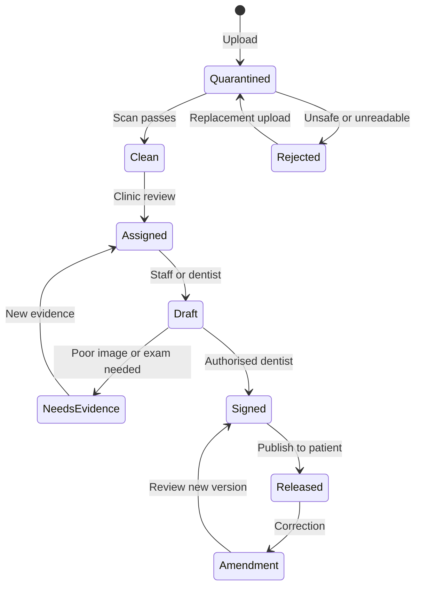

# Roya Darman / Smart Teb — revised 0–100 delivery roadmap
Version: 2026-09-30 · Medical Websites — Operations & Growth · Master RPH-WU-1.
Canonical feature coverage/evidence owner: RPH-57. Decision and hypothesis owner: RPH-85.

## Current verified delivery update — 3 October 2026

The dated evidence below retains its history; the September host/source blockers
are superseded by actual source reconciliation and releases PR49 through PR52.
The verified pre-clinician-preview baseline is PR54 merge `2b6dee2`, 464 matching
live source hashes. The final clinician checkpoint records the subsequent tested
merge, direct-root deployment and private backup identity.
The root site now includes per-session authentication assurance, committed OTP
failure counters, integration corruption/operational-readiness handling, real
profile affiliations and audited preferences, CSP-safe profile controls, clinic
dashboard own-membership isolation, shared server month query/grid bounds and
accepted-referral persisted recipient/delivery correlation, current-session
assurance on all four administrator mutations, and scheduler/per-queue execution
evidence with a bound readiness page. See the four dated release
documents in docs/operations for exact tested/deployed scope.

PR52 evidence: full656 tests/34,317 assertions, isolated VPS PHP8.3.33; focused
synthetic private MariaDB50 tests/510 assertions for PR52; source453 hashes match
the deployed release. Earlier PR50/51 database checks retain their dated scope.
Private source backup/rollback evidence is retained. Existing queue process was
observed active and gracefully reloaded; real scheduled ticks after activation
processed all four harmless queue probes. At15:03:48Z scheduler and each queue
had issued-age45s, runtime stateok and independent backlog stateok. This is
recent execution evidence, not provider delivery or a current-process/capacity
guarantee. ntp.time.ir was observed selected as the chrony source.
Cloud-browser guest inspection reaches the real password/passkey login through
the protected profile redirect; no authenticated staff walkthrough is claimed.

Fresh14:18Z SQL/site backup subsequently passed an isolated restore rehearsal:
61 tables/83 foreign keys restored,10,697 archive files hash-verified; restored
guest login200/protected panel302. A private socket with networking disabled
avoided any production DB privilege expansion; the temporary restore was removed.
Authenticated patient/document recovery and disaster failover are not inferred
from those guest probes.

Deployed PR53 owner analytics adds exclusive-end cohorts,
Tehran Saturday zero-filled weeks, fixed private count projections, current
referral decisions/withdrawal and already-recorded proposal SLA evidence, and
real multilingual CSP-safe charts. It creates no lifecycle events or new access
grants. Its exact tests and limitations are in the dated analytics release record;
its final publication/deployment checkpoint is mirrored to RPH49/57/85/98/99.

The bounded patient-report slice improves already-existing signed/published/current
narratives, dates/original language, document processing and withdrawal controls,
with explicit private/no-store responses. Actual clinician create/publish/patient
read and foreign-patient denial are exercised with synthetic persisted records.
See its dated release record and RPH108 checkpoint for exact tests/deployment.
This is not the tooth-level dental-status/workbench milestone. Release notification
template/event/recipient binding is still absent (F-2026-10-03-07, RPH85/109).
The bounded clinician slice reads own saved unsigned drafts under existing source
approval/consent/assignment/credential rules and improves real creation/publication
controls. Actual endpoint tests reproduced approved-plus-deleted source acceptance;
narrow creation/publication and document status/content guards close that invariant
without inventing retention or signer policy. See the dated clinician release and
RPH107/issue15 checkpoints for executed verification and deployed identity.

Twelve-workspace/branch persistence, capacity-safe clinic booking, clinical report
sign/release and dental status, clinic ledger/payment rules, authenticated recovery
walkthroughs and native Android/iOS apps remain unfinished. Static Studio
screens and unwired agent contracts are labelled prototypes/proposals. Staff MFA
enrolment/recovery, clinical signatures/retention, merchant rules and mobile
stack/signing decisions remain explicit gates. Existing delegated worker plans
continue in their claimed lanes; a clean textual merge does not authorise unsafe
global role/capability activation. No completion percentage is inferred from
tests or screenshots.

## 1. Objective, scope and evidence
Deliver a professional, Persian-first dental coordination platform and clinic product with dedicated dashboards and personal profiles for the owner, developer, superadmins, supervisors, receptionists, accountants, customer support, treatment specialists, clinic managers, dentists/clinical staff and patients. Each feature must be supported by a real authorised backend. Clinical and finance modules are explicit planned scope inside the Smart Teb shared core; their existence is not dismissed because the deployed support module is narrower.

The latest request expands the role taxonomy and the patient-facing dental-status workflow. It does not silently grant every current support/admin role unrestricted access to every clinical record. Platform management breadth, clinical authorship, record access and finance approval are separate capabilities. Superadmins manage all modules and use explicit logged privileges for sensitive tenant records; developer diagnostics use redacted data. The owner can assign policy-approved privileges, with accountable approval and clinical signers identified.

A dedicated dashboard means a dedicated authorised entry view, tasks, metrics, navigation and personal profile. Components and APIs are reused; separate codebases for each job title would increase cost and security drift without improving these user journeys.

### Evidence levels
- **Verified during 29 September production work:** PHP/Blade compilation, password login pages/negative login, Jalali date foundation and Tehran/UTC boundary probes, privacy-safe delivery page/CSV structure and preferred ntp.time.ir with fallback pool.
- **Reported in Agiflow handovers:** Laravel/PHP 8.3 production under cPanel and MariaDB/MySQL-family DB, active source newer than PR #9, existing consent/scanning/audit/session/referral policies. These require source reconciliation before extension.
- **Repository evidence:** current enum has six coarse roles: patient, coordinator, clinician, clinic_rep, owner and tech_admin. This does not establish a granular receptionist/accountant/supervisor permission model.
- **30 September public evidence:** Firecrawl fetched royadarman.com with HTTP 200; public positioning remains preliminary OPG review/support coordination.
- **30 September private inspection blocked:** SentinelX reports Royadarman host inactive due to the one-active-host limit with three connected hosts. No active host was stopped during this roadmap task. A fresh private source/schema inspection is an explicit RPH-49/RPH-96 prerequisite.
- **Unverified:** successful verified-account password E2E; authenticated role/browser journeys; populated event-to-notification correlation; full clinic appointment/tenant/finance/clinical publication modules; versioned holiday dataset; native Android/iOS releases.
- **Design evidence:** all 20 attached screenshots were visually reviewed. They establish reference layouts and feature ideas, not implemented APIs, clinical validity or actual partner data.

Existing Done/Review/In Progress/Blocked statuses retain their history. New work is Planning with unchecked acceptance criteria. No overall completion percentage is invented. The 0–100 coordinates below describe delivery sequencing, not percentage completed or delivery dates.

## 2. Roles, dedicated dashboards and profiles
| Role / workspace | Primary dashboard | Dedicated profile | Authority boundary | Delivery task |
| --- | --- | --- | --- | --- |
| Owner / Maziyar | Network overview, staffing and approvals, operations/authorised financial aggregates, roadmap/feedback | Owner personal identity, preferences, sessions/MFA; organisation management separate | Platform management; sensitive clinic data only through declared granted scope | RPH-99 |
| Developer / Dev | Release/migration, redacted errors, queues/outbox/scanner/storage/provider/NTP, backup checks | Technical membership and devices; no secret display | Technical operations permissions; no routine patient-record browsing | RPH-100 |
| Superadmin | All platform/tenant management modules, role approvals, configuration, audit and incidents | Individual administrator profile, MFA and step-up security | Full management; exceptional sensitive access scoped, time-bound and logged; no clinical signature by admin title | RPH-101 |
| Supervisor | Team workload, SLA, overdue follow-up/review, reassignment/escalation and QA | Team/branch scope, operational versus clinical supervisory qualification | Assigned teams; clinical review only for clinically authorised supervisors | RPH-102 |
| Receptionist | Today's calendar, patient arrival queue, capacity, booking, cancellation/reschedule and payment indicator | Assigned clinics/branches, shift/preferences and session controls | Scheduling/contact fields required for duty; no report signing or unrestricted clinical notes | RPH-103 |
| Accountant | Invoice, collections, reconciliation, ledger, instalments, cheques, refund approvals and exports | Finance membership, branches, approval limits, devices/MFA | Finance/limited identity data; no OPG or clinical narrative by default | RPH-104 |
| Customer support | Tickets/inbox, assigned client requests, delivery states, follow-ups and escalation | Team/shift/preferences/security | Minimal case logistics, authorised conversations; internal clinical notes excluded | RPH-105 |
| Treatment specialist / کارشناس درمان | Staged follow-ups, discussion notes, duration/due dates, referral/matching and clinic handoff | Coordinator assignment/team/branch and security settings | Assigned coordination cases and active referral grants; clinical conclusions come from clinicians | RPH-105 |
| Clinic manager / clinic organisation | Own branches, verified team/services/profile, referrals, schedules/capacity, permitted operational/financial reports | Clinic business profile plus manager's personal profile | Own tenant/branches; staff access explicitly delegated; no shared clinic credentials | RPH-106 |
| Dentist / clinician | Assigned OPG reviews, chart/history, examination, signed report, treatment plan and patient release | Verified clinical credentials, specialties, clinic/branch memberships, personal security | Clinical authorisation + assignment/consent and tenant boundary; only eligible signers publish | RPH-107 |
| Clinical staff / assistant / clinic staff | Role-specific drafting, image-quality/preparation, chair workflow, stock/maintenance where granted | Personal staff profile, qualifications, scope and training | Granular duty permissions; drafts require dentist sign-off; no blanket clinic-staff access | RPH-107/RPH-112 |
| Patient / client; authorised guardian | Requests, OPG review status, released dental findings/plan, appointments, payments and messages | Verified identity/contact, consents, preferences, devices, guardian authority | Own records/released projection only; family contact is not authority to see another record | RPH-108/RPH-62 |

Every personal profile includes verified identity/contact, avatar controls, locale/timezone, notification preferences, active clinic/team memberships, role grants and expiry, password/passkeys/MFA, device/session inventory/revocation and attributable activity. Clinician credentials, finance approval limits and shift/team data are additional role fields. Clinic business profile belongs to its organisation, separate from each person's personal account. Invitations, activation, deactivation, offboarding and rehire are explicit lifecycles. Changing a phone/email or recovery credential needs verification and session review. No shared staff credentials or privilege-changing UI dropdowns in production.

## 3. Architecture and database contract
Retain the implemented Laravel modular monolith on PHP 8.3 and MariaDB/MySQL-family storage. Verify actual production versions/capabilities first. A strong database comes from ownership, constraints, transactions, recovery and measurable query behaviour; a new database brand or microservices rewrite is not a substitute.

### Bounded modules and ownership
1. Platform identity/tenancy/settings and public directory.
2. Coordination/support/referrals/tasks; minimum necessary client logistics.
3. Clinic operations/schedules/resources/staff; authorised own-tenant data.
4. Clinical documents/review/records/treatment; clinician-owned authorship and consent/assignment grants.
5. Finance/ledger/payments/collections; clinic merchant and authorised accounting.
6. Communications/outbox/providers, audit/observability and scoped analytics projections.

Use explicit module service/command boundaries. A dashboard uses authorised read projections; it cannot select unrestricted tables directly. Module ownership is enforced in policies/repositories, routes, background jobs, export handlers, private file reads and analytics. Avoid fragile security that exists only as hidden navigation.

### Proposed relational schema groups
- accounts/profiles, patients, patient-account/guardian links; organisations/branches; memberships/roles/permissions; credentials/invitations/devices/sessions; consent/grant versions.
- clinic/branch services, clinicians/resources/chairs, schedule rules/exceptions, slots/holds/appointments/appointment events/waitlist.
- intake requests/cases/assignments/follow-ups/referrals/consent grants and append-only lifecycle events.
- documents/upload sessions/scan results/private representations/access grants/retention holds; clinical reviews/reports/report versions/findings/annotations/signatures/releases/acknowledgements; treatment plans/stages/procedures and recovery check-ins.
- estimates/invoices/lines/receipts; merchant configs/payment attempts/webhook receipts/refunds; ledger accounts/entries/allocations, instalment and cheque events.
- threads/messages/tasks/SLA and outbox/delivery events; provider health/automation runs; audit/security/read/export events; stock/batches/usage/purchases, staff rosters/training/maintenance.
These are target entities, not claims that all target tables currently exist. RPH-96 produces the exact ERD, naming and migrations after reconciling existing tables.

### Invariants and migration rules
- Every tenant-owned entity carries tenant/branch context; composite references prevent linking records to another tenant inadvertently. Shared patient identity is not shared clinical visibility. Do not claim MySQL native row-level security; app/domain policies and DB constraints both need tests.
- A patient may have distinct clinic-owned records linked by authorised referral/consent; clinic A cannot browse clinic B because they share a phone, geographic area or global patient ID.
- Clinical reports/financial postings preserve immutable signed versions and corrections/reversals. Optimistic version checks prevent lost updates when staff edit concurrently.
- Appointment capacity locks the relevant clinician/chair/resource/slot rows in a transaction. A unique appointment ID alone cannot prevent oversubscription.
- Store timestamps UTC; interpret local booking/report days in Asia/Tehran and convert to half-open UTC ranges. Calendar/holiday/source versions are explicit. Server time source and drift are monitored; user device time is not authoritative.
- Amounts use integer units and an explicit currency; IRR/toman conversion is labelled and tested. Financial calculations never rely on binary floating-point.
- Outbox events commit with domain mutations. Provider delivery is retried outside the transaction using idempotency keys/webhook receipts. Replayed jobs do not resend or repost money.
- Index common tenant/branch/status/date/assignment queries; measure pagination, query plans and data volume. Select a full-text/search adapter only after real requirements justify it.
- Expand/contract schema changes, preflight, source/schema/file backups, restore rehearsal and rollback plans precede direct-root deployment. Source reconciliation protects the newer live code. Do not overwrite clinical records or migrate private files with unchecked scripts.
- Keep upload binaries outside webroot/private storage. Encrypt at rest with managed keys and separate key custody; encrypt transport and secrets. Backups include consistent DB/private files/key recovery, restricted access and legal retention.
- Database users/services have minimum privileges. Query/analytics/queue logs redact PHI and secrets. Audit tracks action/resource identifiers rather than copying every report/body/token into general logs.

## 4. OPG to published dental status
The requested dental-status feature is committed roadmap scope: RPH-108 + RPH-109, backed by RPH-69/70/107. Staff can prepare records within their duties; only eligible authorised dentists sign and release clinical conclusions.

### Patient flow
1. Submit a request with optional OPG or choose “I do not have one”.
2. See upload/scan state, privacy/consent, chosen clinic and an accurate “awaiting clinical review” timeline.
3. A clinic accepts/assigns a qualified reviewer. Clean-file access and active assignment/grants are required.
4. Staff may record image quality or draft findings. Dentist reviews source/history/examination limitations, confirms tooth/surface findings and publishes a signed patient-safe report.
5. Patient sees the released dental chart, per-tooth assessed findings/unknowns, reviewer/clinic/date, preliminary-versus-examination-based status, limits, next steps and released treatment plan. A privacy-safe notification is sent once after committed release.
6. Amendments/retractions preserve previous signed record, link reason/author/time, update current projection and notify where appropriate. Patient acknowledgement is distinct from accepting treatment.

### Clinical record fields
Patient/clinic/branch and review assignment; source document/version/hash; capture date if known; quality/limitations; self-report/history/examination source; dentition/tooth/surface identification; clinician-defined finding code/category and uncertainty; annotations in original-image coordinates; preliminary/final-by-clinician label; report summary/next action; reviewer credential identity; sign/release timestamps; version/amendment/retraction lineage; patient acknowledgement and grant/retention linkage.

“Not assessed”, “not visible” and “unknown” are distinct from a dentist's healthy finding. Missing tooth/implant/restoration and adult/child chart variants require validated clinical definitions. RTL navigation must never mirror dental anatomy or reorder tooth identifiers incorrectly.

The ADA's radiography guidance distinguishes imaging from a complete clinical assessment: our product therefore presents clinician-attributed findings with examination limitations and does not promise a definitive full diagnosis from an OPG alone. The screenshot's 86% or AI-derived recommendations are not default patient data. An optional health score must first define the denominator, clinical meaning, evidence, uncertainty, exclusions and validation; it remains RPH-86 with a visible activation gate. A schematic 3D tooth view is labelled as schematic; patient-specific reconstruction requires actual appropriate imaging and a validated pipeline.

## 5. Feature-by-feature backend completeness ledger
Each feature below requires: data ownership/schema and invariants; permission/action matrix; input validation; authorised endpoints/commands; state transitions; transactional/concurrency/idempotency rules; jobs/notifications; audit/retention/export rules; UI loading/empty/error/retry/accessibility; migration/rollback and positive/negative/E2E proof. The ledger records actual endpoints when implemented; proposed names are not claimed as live routes.
| Feature module | Target backend entities | Supported lifecycle / actions | Task coverage |
| --- | --- | --- | --- |
| Identity and access | accounts, profiles, organisations, branches, memberships, roles, permissions, clinical credentials, sessions, invitations, consent grants | Invite/accept, login/recovery, workspace switch, update profile, activate/suspend/offboard and revoke | RPH-58/59; RPH-96/RPH-97 |
| Clinic discovery | clinics/branches, services, service areas, verified clinicians, opening rules, public prices/reviews | Search/map/list/filter, favourite, selected-clinic handoff; map fallback | RPH-61/51/16 |
| Intake and patient linkage | patients, accounts-to-patients, clinic patient links, intake drafts, requests, guardian/delegate authority | First-time and returning submit, optional OPG, duplicate handling, consent, contact change/merge | RPH-50/62/63; RPH-110 |
| Case coordination | cases, assignments, contact records, follow-ups, SLA events, referrals/grants | Stepwise notes, intervals/due dates, reassign, accept/decline/referral/revoke/close | RPH-52/64/6 |
| Scheduling/reception | clinician/chair/resource schedules, exceptions, slots/holds, appointments, arrival events, waitlist | Reserve/confirm/check-in/cancel/reschedule/no-show, holds expiry and concurrent capacity | RPH-53/65/66/94; RPH-103/RPH-106 |
| OPG/document storage | documents, immutable originals, private thumbnails, scan jobs/results, grants, retention/legal holds | Upload/resume/quarantine/scan/replace/access/download/purge with authenticated handler | RPH-69; RPH-109 |
| Clinical interpretation | review assignments, clinical reports/versions, tooth/surface findings, annotation coordinates, provenance and signatures | Quality check/draft/sign/release/amend/withdraw, examination-needed state and release notification | RPH-70/90; RPH-107/RPH-109 |
| Patient dental-status projection | published report snapshots, released chart/findings, patient acknowledgements | Read current/prior released findings, question/next step; never infer complete health from upload | RPH-62; RPH-108 |
| Treatment and recovery | treatment plan/version/stages/procedures, consents, instructions, check-ins | Clinic-owned plan/sign/amend/release, staged visits, recovery/escalation and attribution | RPH-54/70/89 |
| Finance | estimates, invoice/lines, ledger accounts/entries, receipts, adjustment/refund approvals | Clinic-owned invoice, reconciliation, receipt, cash settlement and exact currency | RPH-71/93; RPH-104 |
| Payments/collection | payment attempts, merchant configs, webhook receipts, instalments, cheque events | Create/reopen link, provider verify, duplicate/late callbacks, partial pay, cheque clearance/bounce | RPH-55/72/73/87 |
| Inbox/notifications | threads/messages, scoped attachments, templates/preferences, outbox, deliveries, devices | Reply/assign/triage, safe SMS/email/push, retry/reconcile, dead-letter and quiet-hour policy | RPH-67/76; RPH-105 |
| Video consultations | consult sessions, authorised participants, provider invitations, consent/recording/transcript versions | Schedule/wait/join/end/fallback; optional approved recording; doctor reviews transcript-derived note | RPH-111 |
| Tasks and supervision | tasks, due rules, escalation, QA assignments, checklists and event history | Create/assign/complete/reopen/reassign, SLA, check-off evidence and supervisor reporting | RPH-68/90; RPH-102 |
| Practice operations | stock/batches/expiry, usage, suppliers/purchases, staff shifts/leave/credential training, assets/maintenance | Restock/use/adjust with approval, roster/onboarding, planned maintenance/compliance signoff | RPH-112 |
| Analytics and CMS | metric definitions, scoped read projections, public pages/service/blog/policy/review content | Source-reconciled charts/exports, locale publish/version/reviewer and SEO | RPH-74/75 |
| Audit and operations | audit/access/security events, incident actions, release/backup evidence, provider health | Redacted timeline/search, privileged-access review, alerts and retention/restore | RPH-97; RPH-82/83 |
| Mobile and automation | versioned endpoints, device sessions/push, compatibility rules, automation definitions/runs | Same domain commands as web, safe offline shell, upload retry/deep links/revocation and rule replay | RPH-78/79/80/81/77 |
| AI/3D/interoperability | approved experiments/models/runs, input grants, draft findings, reviewer corrections, scores/rationale, DICOM/export mappings | Evaluate then controlled activation: assisted drafts, schematic charts versus authentic 3D, external integrations | RPH-86; RPH-85 |

## 6. Revised 0–100 phases and dependencies
Security, design, APIs and tests begin with their modules, not at the end. Phase ranges are sequence coordinates. Dependencies may overlap: a first clinical vertical slice draws P08 work forward; P09 minimum invoice/payment mode is needed before a full accountant demo; native mobile depends on stable APIs.

| Phase / coordinate | Workstream | Primary prerequisites | Exit gate |
| --- | --- | --- | --- |
| P00 · 0–8 | Evidence, source reconciliation and release recovery | Prerequisite to production implementation; evidence collection begins immediately. | A reproducible candidate matches the live baseline; production and backup restores are evidenced; rollback retains data; every known feature has a tracked owner/task and current evidence. |
| P01 · 8–15 | Smart Teb shared core, tenants, identity and permissions | P00 baseline. Required before any expanded clinic/finance/clinical capability. | Two clinics and multiple branches remain isolated through UI/API/search/jobs/cache/files/exports; every role has authorised actions and denial tests; privileged actions require reauthentication and are audited. |
| P02 · 15–23 | Complete design system, role dashboards and profiles | P00/P01. Domain widgets depend on their real module; prototypes use synthetic labelled data. | Each role's signed-in journey has visual and backend evidence; each control has a real authorised action; zero dead/fabricated widgets; RTL does not mirror anatomy; usability/accessibility and mobile review pass. |
| P03 · 23–29 | Public discovery, clinic map, contacts and content | P01 directory data and P04 handoff. | Directory selection ends in a persisted request or confirmed slot as labelled; fake clinics/reviews/addresses are absent; map failures retain usable list and selected branch. |
| P04 · 29–37 | Patient onboarding, profile and dental-status portal | P01/P03; upload/release requires P08 security and clinical review. | With/without OPG and interrupted/returning flows complete correctly; patient sees only own released records; no report is inferred from upload; guardianship and revoke/merge tests pass. |
| P05 · 37–44 | Treatment-specialist CRM, follow-up and referral | P01/P04; P06 clinic acceptance. | Case histories remain attributable through reassignment/referral; due follow-ups escalate; revoked clinic grants cease access; matching rationale and overrides are visible. |
| P06 · 44–54 | Clinic workspaces, appointments and reception | P01/P04/P05. Paid reservation state additionally depends on P09. | Concurrent requests cannot exceed resources; hold/payment races reconcile; persisted appointment equals patient/staff display/notification time; clinic/branch isolation and rollback pass. |
| P07 · 54–60 | Communications, support, tasks and teleconsultation | P01/P05, P08 for clinical attachments/consultation, P11 providers. | Wrong recipients/tenants cannot be selected, failure and retries are visible, redacted support views are enforced and video/recording scope is explicit and tested. |
| P08 · 60–69 | OPG, dental chart, clinical reports and treatment plans | P01/P04; assigned licensed clinical owner, publishing and retention policy. | No unscanned file read; clinical sign/release authorisation and grant expiry hold across viewer/export/jobs; patient sees correct released version and clinical limitations; unknown findings never display as healthy. |
| P09 · 69–77 | Clinic finance, payments, instalments and accounting | P01/P06/P08; merchant ownership, finance approvals and local payment rules. | Gateway failure/retry/double callback and payment-after-expiry cases settle to one correct financial outcome; ledger balances; accountant permissions and exports remain tenant scoped. |
| P10 · 77–82 | Verified reporting, CMS and search visibility | P01 + instrumented domain records. | Metrics reconcile to source records; charts have accessible tables; owner aggregate reports cannot expose clinical files by drill-down; locale/indexing and publishing review pass. |
| P11 · 82–87 | Provider adapters, automation and clinic operations | P01/P07 and relevant domain module. | Provider outage/missing settings has recoverable state; no secret leaks; automation can't bypass revoked permissions; clinic-operations features have contracts and tests or explicit tracked gates. |
| P12 · 87–93 | Responsive web, PWA, Android and iOS | P01/P04/P06/P08 APIs; security begins before app build. | Patient, dentist, receptionist/support role journeys pass on actual devices; revoked device loses access; no PHI in notifications/cache/backups; signed artefacts and release/update evidence exist. |
| P13 · 93–97 | Security, privacy, quality and resilience | Continuous from P00; final release gate for every phase. | No unresolved critical data-loss/security bug, tests cover every role/tenant boundary and lifecycle race; restore and incident response are rehearsed; remaining risks have explicit owners and treatment. |
| P14 · 97–100 | Stakeholder demo, pilot, launch and continuous revision | First integrated demo after P00/P01 and selected P02/P04/P06/P08 vertical slice; later finance/mobile gates follow. | Role workflows accepted, operational owners trained, pilot records/notifications/ledger reconcile, recovery works, mobile releases evidenced and unresolved items remain visible with disposition. |

### P00 — Evidence, source reconciliation and release recovery
Existing tasks: RPH-49, RPH-57, RPH-8/9/10.
New specific tasks: Existing tasks extended; no duplicate phase created.

Reconcile active cPanel source, schema/migration state, document root, queue units, assets and environments against Git. Include 29 September password, Jalali calendar and delivery/NTP changes; never overlay an older PR onto newer production. Record source hashes/commit, consistent source/database/private-file/key backup, reversible migration and release manifest. Repair CI billing/execution blockers or use documented equivalent reproducible local checks without calling skipped CI a pass. Maintain the feature/screen/backend/test coverage ledger and separate deployed, tested, reported and planned evidence.

Acceptance: A reproducible candidate matches the live baseline; production and backup restores are evidenced; rollback retains data; every known feature has a tracked owner/task and current evidence.

### P01 — Smart Teb shared core, tenants, identity and permissions
Existing tasks: RPH-58, RPH-59, RPH-21, RPH-5, RPH-92.
New specific tasks: RPH-96 — Formalise relational database, domain boundaries and migration invariants

Retain Laravel/PHP and MariaDB/MySQL modular monolith. Extend the six-role repository baseline with owner, developer, superadmin, supervisor, receptionist, accountant, customer support, treatment specialist, clinic manager, dentist and scoped clinical staff; patient remains a distinct role. A user may hold multiple memberships and must choose an authorised workspace/tenant/branch. Add granular actions, assignment, grant expiry, consent, credential verification and separation of duties. Password/OTP/passkey, MFA for privileged roles, invitation/recovery, device sessions, account lifecycle and immediate revocation are server controlled. Define domain schemas and composite tenant constraints; no wholesale framework/database replacement.

Acceptance: Two clinics and multiple branches remain isolated through UI/API/search/jobs/cache/files/exports; every role has authorised actions and denial tests; privileged actions require reauthentication and are audited.

### P02 — Complete design system, role dashboards and profiles
Existing tasks: RPH-60, RPH-36, RPH-19 + new role-dashboard tasks.
New specific tasks: RPH-98 — Redesign complete web and mobile design system from supplied references; RPH-99 — Deliver owner management dashboard and secure owner profile; RPH-100 — Deliver developer operations dashboard with redacted diagnostics; RPH-101 — Deliver superadmin management workspace and privileged access workflow; RPH-102 — Deliver supervisor workload, escalation and quality dashboard

Replace the current partial appearance with a unified Persian-first blue/teal product system. Create dedicated owner, developer, superadmin, supervisor, support/specialist, receptionist, accountant, clinic-manager, clinical-staff and patient entry dashboards and profiles. Shared components and API contracts do not mean identical dashboards. Build responsive desktop/tablet/mobile navigation, accessible searchable lists, saved authorised filters, scoped search, task timelines, real metrics, empty/error/offline states, clear dates, and profile/security settings. Reference screenshots are tracked individually; no copied fake clinical percentages, ratings, live capacity or balances.

Acceptance: Each role's signed-in journey has visual and backend evidence; each control has a real authorised action; zero dead/fabricated widgets; RTL does not mirror anatomy; usability/accessibility and mobile review pass.

### P03 — Public discovery, clinic map, contacts and content
Existing tasks: RPH-56, RPH-61, RPH-51, RPH-16, RPH-7.
New specific tasks: Existing tasks extended; no duplicate phase created.

Verified clinics/branches/clinicians/services with map/list parity, Tehran districts, Mashhad and named northern cities; display coverage truthfully. Neshan adapter with quota/offline fallback and accessible list. Selected clinic persists across sign-up/login/request. Verified practitioner profiles, real appointment request/availability, optional favourites, service comparison and clear pricing provenance. Final tooth-plus-support logo and shared Smart Teb product branding. Floating WhatsApp/Instagram/LinkedIn/phone widget from verified settings; it must not obstruct forms or expose patient content to social providers.

Acceptance: Directory selection ends in a persisted request or confirmed slot as labelled; fake clinics/reviews/addresses are absent; map failures retain usable list and selected branch.

### P04 — Patient onboarding, profile and dental-status portal
Existing tasks: RPH-50, RPH-62, RPH-63, RPH-88 + dental-status/identity tasks.
New specific tasks: RPH-108 — Deliver clinician-reviewed dental status in patient dashboard; RPH-110 — Define patient identity merge, guardians and clinic record linkage

First-time request and account formation in one flow; returning patient sign-in without mandatory repeated OTP. Optional OPG with explicit 'I do not have one', guided optional photo capture, minimal history/consent, patient-selected clinic, progress recovery and duplicates handling. Patient dashboard shows requests, review status, released dental chart/report, treatment plan versions, appointments, invoices/instalments, messages, instructions, notifications and profile/security/preferences. Distinguish self-reported symptoms from dentist findings. Guardians/minors, duplicate identity merge, contact changes, multi-clinic linked records and access delegates require explicit policies.

Acceptance: With/without OPG and interrupted/returning flows complete correctly; patient sees only own released records; no report is inferred from upload; guardianship and revoke/merge tests pass.

### P05 — Treatment-specialist CRM, follow-up and referral
Existing tasks: RPH-52, RPH-64, RPH-6, RPH-91.
New specific tasks: Existing tasks extended; no duplicate phase created.

Stepwise specialist/support coordination with assigned clients, conversation summaries, next action, follow-up interval/due timestamp, priority, reminders, escalation, supervisor reassignment and continuity. Record clinic selection/acceptance/decline/reason and referral grant TTL/revocation. Explainable specialty/location/capacity/budget preferences, home-dentistry eligibility/dispatch and patient choice. Keep logistical notes separate from clinical reports. Duplicate reminders and transferred assignment must not contact patients repeatedly or leave stale permissions.

Acceptance: Case histories remain attributable through reassignment/referral; due follow-ups escalate; revoked clinic grants cease access; matching rationale and overrides are visible.

### P06 — Clinic workspaces, appointments and reception
Existing tasks: RPH-53, RPH-65, RPH-66, RPH-94 + receptionist/clinic-manager dashboards.
New specific tasks: RPH-103 — Deliver receptionist scheduling and arrival dashboard; RPH-106 — Deliver clinic manager and branch/staff management dashboard

Each clinic/branch has manager and receptionist workspaces over real schedules, chairs/resources, clinicians, services/durations, slots, capacity, holds, day exceptions, holidays, waiting list and booking policy. Jalali Saturday-first day/week/month views; versioned time.ir-reference holiday dataset and UTC storage/Asia-Tehran boundaries; no undocumented runtime time.ir API. Patient booking/manual booking, free/cash/online modes, confirmed/unpaid states, reschedule/cancel/no-show/check-in/treatment checkout, reminders and approved restrictions. Row locks/idempotency and transactional outbox protect last slot and duplicate callbacks. Existing support operations calendar remains separate until clinic domain exists.

Acceptance: Concurrent requests cannot exceed resources; hold/payment races reconcile; persisted appointment equals patient/staff display/notification time; clinic/branch isolation and rollback pass.

### P07 — Communications, support, tasks and teleconsultation
Existing tasks: RPH-67, RPH-68 + support/teleconsultation tasks.
New specific tasks: RPH-105 — Deliver customer support and treatment-specialist dashboards; RPH-111 — Implement scoped teleconsultation and consented recording workflow

Unified role-scoped inbox, threads, assignments, notes, inbox priorities, templates, approvals, delivery state, attachments, tasks, SLA and escalation. Separate internal clinical notes from patient replies. Support dashboard uses minimal case logistics. Email/SMS/web/push preferences and quiet hours; critical approved communications need a defined policy. Add scheduled clinician consultations/video-provider abstraction with scoped invitation, waiting room, consent, connectivity fallback and optional recording/transcription approval. Booking/reminder/email tasks are idempotent and replayable; avoid leaking clinical content in SMS/push.

Acceptance: Wrong recipients/tenants cannot be selected, failure and retries are visible, redacted support views are enforced and video/recording scope is explicit and tested.

### P08 — OPG, dental chart, clinical reports and treatment plans
Existing tasks: RPH-69, RPH-70, RPH-54, RPH-89, RPH-90, RPH-86 + OPG/dentist tasks.
New specific tasks: RPH-107 — Deliver dentist and authorised clinical-staff workbench; RPH-109 — Implement OPG review, tooth findings, sign-off and publication lifecycle

Secure scan/quarantine/private original/preview lifecycle; structured review assignment, image quality assessment, tooth/surface findings, history and examination references, annotated image overlays, signed preliminary OPG interpretation, amended reports and patient release. Dentist signs/publishes; eligible staff may draft only. Dental chart supports adult/child/missing/restored/implant teeth and unknown/not-assessed states with provenance. Treatment plan stages/procedures/estimates/consent, instructions/recovery check-ins and clinical escalation. Radiographs alone cannot establish a complete definitive diagnosis. AI drafts, scoring, 3D reconstruction, DICOM and external interoperability are retained as explicitly gated RPH-86 capabilities.

Acceptance: No unscanned file read; clinical sign/release authorisation and grant expiry hold across viewer/export/jobs; patient sees correct released version and clinical limitations; unknown findings never display as healthy.

### P09 — Clinic finance, payments, instalments and accounting
Existing tasks: RPH-55, RPH-71, RPH-72, RPH-73, RPH-87, RPH-93 + accountant dashboard.
New specific tasks: RPH-104 — Deliver accountant collections, ledger and reconciliation dashboard

Clinic-owned fees/estimates/invoices/credit adjustments, immutable balanced ledger, cash/card-transfer/online link/free modes as approved, resumable unpaid payment attempts, idempotent verified callbacks and reconciliation. Integer currency minor units; explicit IRR/toman conversion and dated cost ranges; never infer paid from browser return. Partial payments, instalment schedule, cheque received/deposited/cleared/bounced/replaced, refunds, disputed payments, receipts and authorised bank/merchant reporting. Accountant sees needed identity/finance context, no full clinical narrative. Insurance/advanced integrations stay tracked with defined decision gates.

Acceptance: Gateway failure/retry/double callback and payment-after-expiry cases settle to one correct financial outcome; ledger balances; accountant permissions and exports remain tenant scoped.

### P10 — Verified reporting, CMS and search visibility
Existing tasks: RPH-74, RPH-75.
New specific tasks: Existing tasks extended; no duplicate phase created.

Per-role owner/supervisor/clinic/accountant analytics: demand/referrals, appointment utilisation/no-show, follow-up SLA, clinical review queues/latency, payments/collections and staffing. Metrics definitions and drill-down enforce source-record/timezone permissions. CMS multilingual pages/services/blog/clinic profiles, policies/reviewer metadata, sitemap/canonical/indexing and factual schema. Privacy-safe measurement without PHI/contact data or clinical URL payloads. Real consenting reviews/feedback only; do not fabricate social proof.

Acceptance: Metrics reconcile to source records; charts have accessible tables; owner aggregate reports cannot expose clinical files by drill-down; locale/indexing and publishing review pass.

### P11 — Provider adapters, automation and clinic operations
Existing tasks: RPH-76, RPH-77, RPH-17 + inventory/staff/maintenance task.
New specific tasks: RPH-112 — Plan clinic inventory, staff rosters, onboarding and maintenance modules

Secure settings for SMS/email/maps/payments/calendar/time/video/file scanners; encrypt secrets and redact diagnostics, bounded retries/backoff, signed webhooks/idempotency, health checks and incident alerts. Rule automation with preview, scoped owner, approval and replay. Clinical practice operations from reference 112328: inventory/suppliers/batches/expiry/procurement/usage, staff roster/leave/credential expiry/onboarding, task-based maintenance and compliance evidence; scope/clinical/legal templates must be agreed and retained as active tracked decisions. Exact payroll/tax/insurance integrations are not invented.

Acceptance: Provider outage/missing settings has recoverable state; no secret leaks; automation can't bypass revoked permissions; clinic-operations features have contracts and tests or explicit tracked gates.

### P12 — Responsive web, PWA, Android and iOS
Existing tasks: RPH-78, RPH-79, RPH-80, RPH-81.
New specific tasks: Existing tasks extended; no duplicate phase created.

Common versioned APIs with patient/staff roles and device sessions. First deliver responsive web/PWA, then distributable Android and iOS patient/staff flows. Secure token storage, push registration/revocation, camera/gallery permissions, upload recovery, deep links, app version compatibility, low bandwidth and assistive technology. Cache public shell only; private reports/messages/files never become offline data by accident. Optional encrypted approved offline drafts are a separately decided capability. App signing/distribution/store accounts and update/incident runbooks are prerequisites; PWA does not count as native completion.

Acceptance: Patient, dentist, receptionist/support role journeys pass on actual devices; revoked device loses access; no PHI in notifications/cache/backups; signed artefacts and release/update evidence exist.

### P13 — Security, privacy, quality and resilience
Existing tasks: RPH-82, RPH-83, RPH-20 + audit task.
New specific tasks: RPH-97 — Implement complete audit and privileged-access event lifecycle

Threat modelling, ASVS-based verification, per-action authorisation, audit/read/export/security events, immutable clinical/finance amendments, anti-abuse, CSRF/XSS/SQLi/IDOR/file attacks and dependency patching. Sensitive logs are redacted; append-only logs get external integrity monitoring rather than false 'tamperproof' claims. Backup/restore includes DB/private files/encryption keys and evidence; key custody/rotation/retention/holds, RPO/RTO, storage/queue exhaustion, provider outage and rollback rehearsals. Test actual production-family DB, not SQLite alone, and measure performance/accessibility/load targets.

Acceptance: No unresolved critical data-loss/security bug, tests cover every role/tenant boundary and lifecycle race; restore and incident response are rehearsed; remaining risks have explicit owners and treatment.

### P14 — Stakeholder demo, pilot, launch and continuous revision
Existing tasks: RPH-84, RPH-85, RPH-34.
New specific tasks: Existing tasks extended; no duplicate phase created.

Give individual role accounts through secure invitations and synthetic tenant data. Show owner/developer/superadmin/supervisor/reception/accounting/support/clinic/dentist/patient journeys over persisted backend records. Demo/pilot enablement separate from real intake and actual clinical/finance activation. Direct-root incremental releases remain authorised with backup/rollback; isolated testing need not be a public staging site. Track staffing, clinic ownership, consent/retention, policies/clinical/legal review, merchant readiness and feedback. Every request becomes implemented/tested, planned, blocked with owner, or explained conditional/deferred; never silently dropped.

Acceptance: Role workflows accepted, operational owners trained, pilot records/notifications/ledger reconcile, recovery works, mobile releases evidenced and unresolved items remain visible with disposition.

## 7. Demonstration and release sequence
- **Foundation:** P00 source reconciliation + RPH-96 schema + RPH-58 identity/tenant grants + RPH-97 audit + RPH-98 common visual system. Privileged/patient/password happy paths require evidence.
- **First integrated clinical slice:** individual patient/support/clinic/dentist/supervisor accounts, request with/without OPG, scan/assign/draft/sign/publish, patient released chart/status, support next action and audit. Use two synthetic clinics to prove isolation.
- **Scheduling/reception slice:** real capacities/holds/manual and online booking, Jalali/timezone, arrival/reschedule/cancel/no-show, delivery correlation and retries. Verify stored event equals notification and staff/patient view.
- **Finance/accountant slice:** invoice, approved online/offline mode, abandoned-payment retry, verified callback, ledger and receipt, instalment/cheque lifecycle, scoped accountant export and approval.
- **Full management and practice-operations slice:** owner/developer/superadmin dashboards over actual scoped aggregates/events, clinic manager, staff/inventory/maintenance/QA and integration diagnostics.
- **Distribution/pilot:** responsive/PWA proof, Android and iOS real-device/API/security evidence, signed distribution/update; real clinical/finance activation only after named ownership and policy/provider gates.

User authorisation permits incremental releases directly in the production root with backup and rollback. This roadmap task makes planning/documentation changes; it does not deploy new roles/clinical records/schema or enable real intake. Isolated synthetic test fixtures/local CI are required and do not require a public staging website. Never count a public noindex staging site as access control.

All demos use secure individual invites and realistic synthetic records, conspicuously labelled. Empty metrics remain empty when no source data exists. A polished prototype alone is not backend completion.

Definition of Done: migrated backend + all authorised role actions + prohibited paths + relevant concurrency/outage tests + persistent/event/notification/ledger reconciliation + audit/retention/backup proof + reference/accessibility/mobile review + source/release evidence + operational handover. An open activation gate is visible, not hidden behind a Done label.

## 8. Reference registry — all 20 screenshots
Images are stakeholder-supplied design references. Stock names, scores, logos, prices and sample records are not production facts. Each original is attached to the task identified below; other section owners refer to its reference ID.
| Ref | Original filename | Relevant section / phases | Primary attached task | Adaptation and corrections |
| --- | --- | --- | --- | --- |
| R01 | image(20260930-111924).png | Patient discovery, dentist profile and slot booking (P03/P04/P06/P12) | RPH-108 | Use hierarchy and compact mobile slots; show verified practitioners and persisted availability. |
| R02 | image(20260930-111931).png | Services, clinician profile and date/time selection (P03/P06/P12) | RPH-98 | Adapt service cards and clear booking action; retain blue/teal brand instead of separate lavender brand. |
| R03 | image(20260930-112041).png | Search, filters, nearby practitioners and services (P03/P04) | RPH-61 | Search/filter backend and real location coverage; verified price/specialty/online status only. |
| R04 | image(20260930-112141).png | Patient status overview, recommendations and appointments (P04/P08) | RPH-108 | Adapt to signed dental findings; exclude unrelated brain metrics and undefined health percentages. |
| R05 | image(20260930-112219).png | Provider directory and specialty/service discovery (P03/P04/P12) | RPH-61 | Persist selected service/clinic through authentication; real reviewed providers. |
| R06 | image(20260930-112328).png | Staff tasks, calendar, onboarding, compliance, stock and maintenance (P02/P07/P11) | RPH-112 | Track staff scheduling, onboarding, inventory and maintenance as explicit modules. |
| R07 | image(20260930-112451).png | AI drafts, scheduling automation and collaborative cases (P06/P08/P11) | RPH-86 | AI remains proposed decision-support with human review; scheduling uses transactional backend. |
| R08 | image(20260930-112519).png | Dental viewer, tooth findings, image tools and assistant (P08) | RPH-107 | Tooth chart and viewer first; 3D/AI data needs validated source and provenance. |
| R09 | image(20260930-112547).png | Radiograph/dental viewer tabs and care assistant (P08) | RPH-107 | Pan/zoom, actual image variants and report tabs; image controls never alter original. |
| R10 | image(20260930-112619).png | Compact tooth status, report panels and next action (P04/P08) | RPH-108 | Patient-safe published projection; missing evidence shown as unknown. |
| R11 | image(20260930-112640).png | Wireframes and design-system composition (P02) | RPH-98 | Use prototype review and reusable layout/components before full visual rollout. |
| R12 | image(20260930-112650).png | Clinic visit, revenue, payment and schedule analytics (P02/P06/P09/P10) | RPH-106 | Role-specific metrics with authorised drill-down; never decorative balances or revenues. |
| R13 | image(20260930-112715).png | OPG/radiograph review, patient tabs and tooth annotations (P08) | RPH-109 | Clinical patient association, image quality, annotations and signed version history. |
| R14 | image(20260930-112738).png | Mobile dental chart, oral status and treatment steps (P04/P08/P12) | RPH-108 | Use readable chart/steps; displayed 86% is a research feature, never a fabricated patient score. |
| R15 | image(20260930-112805).png | Patient record with OPG, history and clinical workbench (P08) | RPH-107 | Only necessary dental/medical history and clinician-signed instructions; no automatic prescribing. |
| R16 | image(20260930-112913).png | Mobile payment choices, consult scheduling and video call (P07/P09/P12) | RPH-111 | Video requires scoped session/provider/consent; payment options reflect available approved Iranian providers. |
| R17 | image(20260930-113143).png | Public service cards, dentist list, map and booking (P03) | RPH-61 | Verified map/list and coherent dental landing; booking request versus confirmation is labelled. |
| R18 | image(20260930-113210).png | Full landing page, clinic information and appointments (P03/P02) | RPH-98 | Adapt whole-page flow and calls to action; final logo and legal content needed. |
| R19 | image(20260930-113327).png | Detailed clinical record overview and contextual panels (P08/P02) | RPH-107 | Adapt dental history and findings; hospital-specific admissions/general vital widgets only if clinically required. |
| R20 | image(20260930-113347).png | CRM leads, conversion, follow-ups and scheduled activity (P05/P07/P10) | RPH-105 | Real case/referral funnel and next action; choose restrained staff styling over promotional hero. |

## 9. Failure modes, security threats and unresolved implementation register
The 37 cases below are the identified coverage baseline, not a guarantee that all future possibilities have been predicted. New findings are added through threat modelling, tests, incidents and user feedback. For each case the implementation task must record the assumption, disconfirming evidence, chosen treatment, accountable role, acceptance test, residual risk and next review. Nothing is silently forgotten.
| Failure / hypothesis | What can go wrong | Treatment / verification | Task owner | Evidence state |
| --- | --- | --- | --- | --- |
| Cross-clinic/branch IDOR | Same record ID in another tenant, URL tampering, export/search/attachment/job leak | Central resource policy plus tenant-scoped repositories/composite constraints; negative role/tenant/branch tests on every channel | RPH-58/82/96/97 | Planned expanded matrix; existing boundaries preserved |
| Stale access after transfer/offboarding | Revoked membership/consent remains in cached results, queued jobs or signed URLs | Revalidate access at execution/download; expire links/session tokens; tenant-aware cache invalidation | RPH-58/69/78/82 | Planned verification |
| Admin privilege escalation | Administrator grants self clinical/finance power or impersonates patient | Step-up, scoped/time-limited privilege, approval separation/reason, alerts and read-access audit | RPH-97/101/58 | Policy decision required |
| Shared staff account | No attribution after shift change; one leak exposes clinic | Individual invitations/profiles/devices; membership revocation and break-glass accounts only by procedure | RPH-59/60/106 | Planned |
| Credential compromise/recovery | OTP fatigue, SIM swap, credential stuffing, recovery bypass | Password/passkey/MFA, rate limits, generic responses, secure recovery and other-session revocation | RPH-59/82 | Password deployed-reported; successful verified-account E2E still open |
| Duplicate identity/family phone | Wrong merge links clinical files or debts | Account/patient separation, explicit authorised merge, guardian authority and provenance/undo plan | RPH-110 | Open design |
| Minor or delegated patient | Consent authority unclear; adult child gains inappropriate access | Verified guardians/delegates, expiry and jurisdiction/age rules; owner clinical/legal decision | RPH-110/58 | Decision-gated |
| No OPG available | Patient blocked from request | Optional upload with explicit no-OPG path; route to consultation/examination without invented findings | RPH-50/62/108 | Planned end-to-end evidence |
| Malicious/disguised upload | Polyglot, huge pixels, metadata leakage, decompression bomb, PDF/DICOM parser exploit | Allowlist/signature/MIME/size/pixel limits; quarantine scanner, private storage, sandbox preview and dependency patching | RPH-69/82 | Existing pipeline reported; broader proof open |
| Scanner/storage outage | Unscanned image becomes readable; upload loses reference | Fail-closed review/access, recoverable queued state, retry/monitor/quota and checksum | RPH-69/83 | Planned failure proof |
| Interrupted or duplicate upload | Same OPG twice, partial object exposed, wrong patient link | Resumable scoped session/checksum, staged object cleanup and association confirmation | RPH-69/109 | Planned |
| Wrong orientation/tooth label | RTL mirrors OPG or annotates wrong tooth | Preserve original orientation; viewer-only transforms flagged; adult/child numbering and coordinate validation | RPH-98/107/109/82 | Design/clinical validation required |
| Poor image/incomplete evidence | Normal colour shown for an unassessed tooth; OPG-only definitive claim | Unknown/not assessed states, quality/limitations, needs-image/examination action and clinician attribution | RPH-109/108/70 | Planned clinician protocol |
| Unauthorised clinical author | Receptionist or admin publishes diagnosis | Draft versus eligible clinician sign/release permissions, credential check and immutable version | RPH-107/109/58 | Planned |
| Amended/retracted report | Patient sees stale report after correction | Version chain/current pointer, superseded flag, reasons, authorised release/retraction and once-only notifications | RPH-109/108/70 | Planned |
| Clinician review backlog | Patients interpret silence as good health | Assigned queue/SLA, explicit awaiting-review status, supervisor escalation and coverage fallback | RPH-90/102/109 | Staffing/threshold decisions open |
| Acute symptoms after upload | Unsupported promise of emergency response | Clinical owner defines red-flag protocol/care limits, staffed escalation and in-person referral; log acknowledgement | RPH-90/89 | Clinical decision-gated |
| Health score/AI misinformation | Attractive percentage lacks scientific basis or model invents disease | No production default score; validate definition/data/subgroups/confidence, human review, feature flag/rollback and provider consent | RPH-86/85 | Research planned; live activation gated |
| 3D from 2D illusion | Schematic visual appears to be patient-specific reconstruction | Label schematic separately; authentic 3D requires valid imaging source/validated pipeline; never imply OPG contains unavailable detail | RPH-86/107 | Assessment pending |
| Last-slot race | Two bookings exceed clinician/chair capacity | DB transaction/row lock/capacity check, idempotency keys and concurrent tests | RPH-65/96/82 | Clinic scheduler unimplemented at last verified baseline |
| Hold expiry/payment race | Payment completes after slot lost | Policy for reacquire/alternative/refund, compensating ledger action, once-only notification and support reconciliation | RPH-65/72/71 | Decision/planned |
| Reschedule/day closure/no-show | Clinician absence leaves appointments orphaned | Explicit statuses, affected bookings queue, supervisor actions, patient consent/notifications and history | RPH-65/103 | Planned |
| Calendar/time mismatch | Wrong Jalali boundary, leap day, Friday/holiday or device time | UTC persistence/local half-open queries, verified year dataset/provenance, timezone history, server NTP fallback and drift alerts | RPH-94/65/100 | 1405 foundation verified Sep29; holiday/pair/E2E gaps open |
| Gateway return/error/unpaid retry | Browser return marked paid or abandoned payment blocks re-entry | Server verification, resumable payment attempt identity, provider timeout reconciliation and no duplicate charge | RPH-72/71/82 | Planned Roya Darman finance; DrB evidence is separate |
| Duplicate/out-of-order callback | Repeated posting or booking confirmation | Verified webhook receipt ID/dedupe, event state machine, immutable ledger and transaction/outbox | RPH-72/96/82 | Planned |
| Currency/rounding mistake | Toman/IRR off by 10; JS float loses precision | Integer amounts/currency codes, explicit display conversion, ledger validation and receipts | RPH-71/93/104 | Planned |
| Partial payment/cheque/refund | Debt disappears on cheque receipt; bounce/replacement doubles debt | Separate cheque lifecycle from cleared money, signed approval/reversal ledger, instalment allocation and audit | RPH-73/71/104 | Planned |
| Wrong notification/duplicate message | PHI to wrong patient; retries resend | Commit-based transactional outbox, authorised recipient and locale, template classification/dedupe, redacted SMS/push | RPH-67/76/82/109 | Delivery UI deployed; populated correlation test open |
| Video/recording privacy | Leaked invite or unconsented recording | Scoped expiring provider invite/waiting room, participant checks, explicit consent/retention and controlled transcript | RPH-111/76/97 | Planned provider/authority gates |
| Reports/analytics leak | Sensitive drill-down, tiny cohorts or unsafe CSV | Permission-aware projections, suppression where appropriate, minimal export, CSV formula guard, audit | RPH-74/97/82 | Delivery CSV guard verified Sep29; cross-module proof open |
| Offline/mobile leak | Private PDF retained after logout, notification reveals finding | No private offline cache by default, secure device token storage, generic push, revoke and real-device tests | RPH-78/79/80/81/82 | PWA foundation reported; native apps planned |
| Backups/keys lost or exposed | Restore unavailable or public backup reveals PHI | Private encrypted consistent DB/files/key backups, separate custody, restore rehearsal, retention/legal holds | RPH-83/97 | Backup exists; complete recovery evidence open |
| Audit compromise/clock drift | Root rewrites local logs, sequence loses order | Restricted append-only events, monotonic/object sequence and correlation, external integrity checkpoint/sink, drift alerts | RPH-97/83/94 | Planned; never claim absolute tamperproof |
| Resource exhaustion/provider outage | Queue fork failures, disks full, map/SMS unavailable | Backpressure/quota/alerts, bounded retries/dead-letter, accessible fallback and incident ownership | RPH-76/83/100 | Known operational risk; readiness evidence needed |
| Destructive migration/older source | Old branch overwrites current auth/calendar or corrupts clinic links | RPH49 reconciliation, expand/contract migration, backup/read-back, rollback preserving new data | RPH-49/96/83 | Open prerequisite |
| Fake reference metrics/practitioners | Prototype names/ratings/3D/health stats mistaken for reality | Label synthetic demos; production only verified source-backed metrics/content and actual clinician credentials | RPH-57/98/61/74/84 | Planning rule |
| Scope omissions/unknown future case | A feature becomes forgotten after discussion or rejected silently | Coverage ledger + hypothesis/decision register, review cadence and incident-driven amendments; every disposition explained | RPH-57/85 | Register established in this revision |
## 10. Open decisions and activation gates
The accountable job titles below must be assigned to named people; this roadmap does not fabricate appointed clinical/legal/security owners. Work on reversible design/schema/contracts/synthetic tests can progress while these decisions are pending. Feature activation waits only on its relevant unresolved prerequisite.
| Decision | Accountable role to nominate | Required before / task |
| --- | --- | --- |
| Named clinical lead, eligible report signers and clinical-supervisor authority | Clinical owner + platform owner | Before any real dental report/signature; RPH-90/107/109 |
| Full-admin sensitive access scope, approval model and break-glass policy | Owner + security/privacy owner | Before expanded roles; RPH-58/97/101 |
| Clinic record controller/ownership, consent transfer, withdrawal, legal holds and retention periods | Clinic owners + qualified local legal/privacy adviser | Before clinical/finance activation; RPH-69/83/110 |
| Guardian age/identity/authority and safe duplicate-record merge rules | Clinical/privacy/operations owners | Before guardian/merge capability; RPH-110 |
| Clinical taxonomy, adult/child tooth numbering, quality thresholds and preliminary/final report language | Clinical lead | Before review/chart publication; RPH-70/109 |
| Review/follow-up SLA, coverage, emergency escalation and 24/7 claims | Supervisor + clinical lead + owner | Before public promises/live intake; RPH-64/90 |
| Clinic branches/practitioners/service-area and contacts/logo rights verified | Owner + clinic managers | Before public discovery publication; RPH-56/61 |
| Merchant ownership, gateway credentials, fees, cancellation/refund/late-payment rules | Clinic owner + finance lead | Before actual collection; RPH-55/65/71/72 |
| Instalment/cheque contracts, settlement, approval limits, insurance/tax reporting | Finance lead + local adviser | Before finance-specific modes; RPH-73/87/104 |
| time.ir holiday year source/version/licence/update ownership and NTP drift/fallback monitoring | Technical owner + operations supervisor | Before holiday-dependent capacity decisions; RPH-94/100 |
| AI/health score scientific definition, validation and processor/hosting/consent safeguards | Clinical lead + privacy/technical owner | Before AI/scoring activation; RPH-86 |
| Schematic dental chart versus authentic 3D/DICOM needs and hardware performance | Clinical + technical lead | Before advanced viewer promise; RPH-86/107 |
| Video provider, local authority, recording/transcription consent and retention | Clinical/privacy/technical owners | Before live video/recording; RPH-111 |
| Inventory/maintenance/compliance templates and staff/payroll scope | Clinic/clinical/finance managers | Before operation module activation; RPH-112 |
| Supported mobile devices/OS, app distribution/signing/store accounts, push provider and updates | Owner + mobile developer | Before Android/iOS delivery commitment; RPH-78/80/81 |
| Exact DB engine/version, measured scale, index/query budgets, RPO/RTO and key custody | Technical owner + owner | Before schema changes/production acceptance; RPH-96/83 |
| Secure individual stakeholder invitations and synthetic demonstration fixture set | Owner + relevant role managers | Before demo; RPH-84/60 |
| Release staffing/capacity, priorities and calendar dates | Owner + delivery lead | Set dates after source reconciliation; no invented delivery schedule |
## 11. Status and scope reconciliation
- Existing support workspace, session/referral foundation, public matching and integration settings are reused; tasks marked Done historically keep their evidence but do not imply expanded roles/modules are complete.
- RPH-36 remains Review for its earlier support-workspace scope. The expanded appearance/dashboards are RPH-60/RPH-98–108 and do not retroactively change its acceptance claim.
- RPH-49 remains In Progress for broader delivery. Source reconciliation and direct-root releases PR49–52 are verified; canonical Git and live source match PR52 as recorded above. The September quota/source mismatch blocker is historical. Tests ran in isolated checkouts; no production PHPUnit workflow is claimed.
- RPH-59 remains In Progress for authenticated password/credential setup E2E, despite reported deployment of routes and login UI.
- RPH-65/RPH-94 remain In Progress. Shared coordinator month bounds, persisted-event inclusion/exclusion and accepted-referral notification correlation are verified in synthetic SQLite/MariaDB tests. That is not a complete clinic scheduler or actual provider-delivery proof. Holiday dataset, tenant/resource scheduling, concurrent slots and authenticated browser journeys remain open.
- RPH-69/70 and the new RPH-107–109 clinical workflows are Planning; no claim that patients can currently receive a signed dental chart after OPG upload.
- Clinic billing/instalments/cheques/accountant module and native Android/iOS remain Planning. A PWA is not the Android/iOS app.
- Advanced AI/3D/DICOM/interoperability, insurance and regional expansion remain active assessment tasks, not dismissed features. Their decisions and conditions must be documented on RPH-86/87/92 and RPH-85.
- Inventory/staff onboarding/maintenance/video are now explicitly tracked by RPH-111/112. A third-party screenshot does not justify copying unrelated hospital/brain metrics into dental records.
- No fabricated schedule/cost/overall completion percentage. Owner and delivery lead set dates after baseline/capacity assessment. Proposed initial performance/recovery targets require measurements and acceptance; they are not present guarantees.

## 12. Change control, hypotheses and learning
RPH-57 is the feature/screen/backend/test ledger. RPH-85 is the hypothesis/decision/gap register. Every suggestion gets an ID, source/reference, intended user/problem, benefit and risk hypothesis, task/phase, dependency, accountable role, evidence and disposition:
**implemented and verified / deployed but verification open / planned / blocked / conditional activation / explicitly deferred with reason and revisit date**.
A feature may not disappear merely because its first proposal is unsafe or incomplete; correct the design, record alternatives and retain the unresolved requirement. Critical bugs override cosmetic work, but cosmetic defects are still planned. Completion claims cite a release/source hash, test results and remaining limitations.

Proposed first performance budgets: identify representative tenant volumes and measure list/dashboard/booking p95; choose budgets after baseline. Proposed backup RPO/RTO and log retention are owner/security/clinical/finance decisions before launch. No invented benchmark or legal retention period is adopted here.

## 13. Primary sources checked for this revision
- OWASP Authorization Cheat Sheet — https://cheatsheetseries.owasp.org/cheatsheets/Authorization_Cheat_Sheet.html (retrieved with Firecrawl 2026-09-30). Basis for deny-by-default, per-request/resource checks and combining roles with contextual relationships.
- OWASP Logging Cheat Sheet — https://cheatsheetseries.owasp.org/cheatsheets/Logging_Cheat_Sheet.html (2026-09-30). Basis for attributable security/action events and excluding tokens/passwords/health/payment data from ordinary logs.
- OWASP File Upload Cheat Sheet — https://cheatsheetseries.owasp.org/cheatsheets/File_Upload_Cheat_Sheet.html (2026-09-30). Basis for private storage, validation, quarantine/scanning and recoverable access states.
- American Dental Association, X-Rays/Radiographs — https://www.ada.org/resources/ada-library/oral-health-topics/x-rays-radiographs (2026-09-30). Basis for clinician interpretation and clinical-examination limitations; international professional reference, not Iran-specific legal approval.
- time.ir — https://www.time.ir/ (previously reviewed 2026-09-29, RPH-94). Calendar reference; official NTP described as experimental. Keep fallback time sources/drift checks and versioned calendar data; no undocumented runtime scraping dependency.
- Existing repository canonical architecture (2026-09-16), the manager/Gemini research attachments and latest Agiflow RPH-36/49/59/65/94 handovers. Screenshots reviewed 2026-09-30.

## 14. Specific new task contracts
| Task | Phase | Explicit deliverable | Dependencies |
| --- | --- | --- | --- |
| RPH-96 | P01 | Formalise relational database, domain boundaries and migration invariants | RPH-49, RPH-58 |
| RPH-97 | P13 | Implement complete audit and privileged-access event lifecycle | RPH-58, RPH-82, RPH-83 |
| RPH-98 | P02 | Redesign complete web and mobile design system from supplied references | RPH-57, RPH-60 |
| RPH-99 | P02 | Deliver owner management dashboard and secure owner profile | RPH-58, RPH-60, RPH-74 |
| RPH-100 | P02 | Deliver developer operations dashboard with redacted diagnostics | RPH-49, RPH-58, RPH-76, RPH-83 |
| RPH-101 | P02 | Deliver superadmin management workspace and privileged access workflow | RPH-58, RPH-60, RPH-82 |
| RPH-102 | P02 | Deliver supervisor workload, escalation and quality dashboard | RPH-58, RPH-64, RPH-68, RPH-74, RPH-90 |
| RPH-103 | P06 | Deliver receptionist scheduling and arrival dashboard | RPH-53, RPH-58, RPH-65, RPH-66, RPH-72 |
| RPH-104 | P09 | Deliver accountant collections, ledger and reconciliation dashboard | RPH-58, RPH-71, RPH-72, RPH-73 |
| RPH-105 | P07 | Deliver customer support and treatment-specialist dashboards | RPH-58, RPH-52, RPH-64, RPH-67, RPH-68 |
| RPH-106 | P06 | Deliver clinic manager and branch/staff management dashboard | RPH-58, RPH-53, RPH-65, RPH-74, RPH-76 |
| RPH-107 | P08 | Deliver dentist and authorised clinical-staff workbench | RPH-58, RPH-69, RPH-70, RPH-89, RPH-90 |
| RPH-108 | P04 | Deliver clinician-reviewed dental status in patient dashboard | RPH-62, RPH-69, RPH-70, RPH-86 and OPG workflow task |
| RPH-109 | P08 | Implement OPG review, tooth findings, sign-off and publication lifecycle | RPH-58, RPH-69, RPH-70, RPH-62, RPH-67 |
| RPH-110 | P04 | Define patient identity merge, guardians and clinic record linkage | RPH-58, RPH-50, RPH-62, RPH-69 |
| RPH-111 | P07 | Implement scoped teleconsultation and consented recording workflow | RPH-65, RPH-67, RPH-69, RPH-70, RPH-76 |
| RPH-112 | P11 | Plan clinic inventory, staff rosters, onboarding and maintenance modules | RPH-58, RPH-68, RPH-71, RPH-76 |

### RPH-96 — Formalise relational database, domain boundaries and migration invariants
Define ERD and data ownership for platform, support, clinic, clinical and finance domains. Include tenant/branch composite foreign keys, patient-clinic linkage/consent, clinical versioning, booking constraints, exact currency ledger, transactional outbox, webhook receipts and audit schemas. Inspect actual production engine/version before migrations. Choose retained MariaDB/MySQL modular monolith unless measured evidence supports a change.

Backend proof: schema/invariants, policy, API/command, lifecycle, failure/retry/concurrency, audit/retention and positive/negative/E2E evidence. Acceptance criteria and test cases are stored unchecked on the task. Dependencies: RPH-49, RPH-58.

### RPH-97 — Implement complete audit and privileged-access event lifecycle
Audit authentication/recovery, role/membership/grant changes, sensitive reads/downloads/exports, clinical sign/release/amend, bookings/referrals, finance adjustments and provider changes. Record actor, tenant, object, action, outcome, UTC time, request/correlation ID and reason. Redact PHI/secrets; define log integrity, restricted viewing, retention and failure handling. Full administrators get operational management plus explicit scoped/time-limited sensitive-data privileges; developer diagnostics remain redacted.

Backend proof: schema/invariants, policy, API/command, lifecycle, failure/retry/concurrency, audit/retention and positive/negative/E2E evidence. Acceptance criteria and test cases are stored unchecked on the task. Dependencies: RPH-58, RPH-82, RPH-83.

### RPH-98 — Redesign complete web and mobile design system from supplied references
Create a traceable coherent blue/teal Persian-first design system for all public/patient/staff/clinic screens. Reference registry R01–R20 maps every screenshot to component/feature/task. Design navigation, typography, card/table/clinical-viewer patterns, skeleton/empty/error/loading/offline states, keyboard/focus/contrast/touch targets, tablet/mobile and RTL. Every clickable widget must bind to a real authorised backend. Original dental/radiograph orientation is preserved.

Backend proof: schema/invariants, policy, API/command, lifecycle, failure/retry/concurrency, audit/retention and positive/negative/E2E evidence. Acceptance criteria and test cases are stored unchecked on the task. Dependencies: RPH-57, RPH-60.

### RPH-99 — Deliver owner management dashboard and secure owner profile
Owner (Maziyar) sees clinic network, onboarding, operations KPIs, referrals, SLA, financial aggregates when authorised, staffing/access approvals, roadmap/release health and feedback. Profile has identity/contact, active memberships, MFA/passkeys, sessions, notification/language/timezone settings and personal action history. Detailed patient/clinical reads require explicit audited grants; management breadth is not accidental database visibility.

Backend proof: schema/invariants, policy, API/command, lifecycle, failure/retry/concurrency, audit/retention and positive/negative/E2E evidence. Acceptance criteria and test cases are stored unchecked on the task. Dependencies: RPH-58, RPH-60, RPH-74.

### RPH-100 — Deliver developer operations dashboard with redacted diagnostics
Dedicated developer workspace for release versions/hashes, migrations, queue/outbox health, scanner/storage/provider status, time-sync health, exception correlation, backup/restore status, feature flags and API health. Safe redacted drill-down; credentials/PHI never displayed. Production debug/access actions require explicit scoped authorisation and audit; prohibit role impersonation bypass.

Backend proof: schema/invariants, policy, API/command, lifecycle, failure/retry/concurrency, audit/retention and positive/negative/E2E evidence. Acceptance criteria and test cases are stored unchecked on the task. Dependencies: RPH-49, RPH-58, RPH-76, RPH-83.

### RPH-101 — Deliver superadmin management workspace and privileged access workflow
Full platform-management dashboard: clinics/branches, accounts/roles/policies, security incidents/audit, system settings, feature activation, global reports and administrative workflow overrides with reasons. Sensitive tenant/clinical reads/exports need declared scope, step-up authentication, time bound access and alerts; superadmin cannot sign a clinical report merely because of admin status. Individual profile and session inventory required.

Backend proof: schema/invariants, policy, API/command, lifecycle, failure/retry/concurrency, audit/retention and positive/negative/E2E evidence. Acceptance criteria and test cases are stored unchecked on the task. Dependencies: RPH-58, RPH-60, RPH-82.

### RPH-102 — Deliver supervisor workload, escalation and quality dashboard
Dedicated supervisor workspace: assigned teams, workload/case status, overdue follow-ups/review queues, SLA breaches, escalation/reassignment, QA sampling and outcome trends. Scope by team/tenant/branch. Clinical peer-review restricted to clinical supervisors with verified credentials; ordinary operational supervisors manage logistics. Include own profile and notification/security settings.

Backend proof: schema/invariants, policy, API/command, lifecycle, failure/retry/concurrency, audit/retention and positive/negative/E2E evidence. Acceptance criteria and test cases are stored unchecked on the task. Dependencies: RPH-58, RPH-64, RPH-68, RPH-74, RPH-90.

### RPH-103 — Deliver receptionist scheduling and arrival dashboard
Today's clinic/branch schedule, waiting/arrival queue, clinician/chair capacity, patient contact details needed for booking, check-in/out, reschedule/cancel/no-show, restrictions and cash/free/online appointment handling. Receipts/payment indicator derives from finance backend. Reception cannot publish diagnosis or clinical notes. Own clinic/branch profile, shift/preferences/security and audited manual overrides.

Backend proof: schema/invariants, policy, API/command, lifecycle, failure/retry/concurrency, audit/retention and positive/negative/E2E evidence. Acceptance criteria and test cases are stored unchecked on the task. Dependencies: RPH-53, RPH-58, RPH-65, RPH-66, RPH-72.

### RPH-104 — Deliver accountant collections, ledger and reconciliation dashboard
Outstanding balances, invoice/receipt, payment attempts, reconciliation, cash settlement, instalments, cheque calendar/bounced follow-up, refunds/adjustment approvals and authorised exports. Exact amounts and IRR/toman labels; invoices reconcile to immutable ledger. Needed patient identity is minimised; clinical narrative/OPG is excluded. Dedicated finance profile, branch scope, approval limits and session security.

Backend proof: schema/invariants, policy, API/command, lifecycle, failure/retry/concurrency, audit/retention and positive/negative/E2E evidence. Acceptance criteria and test cases are stored unchecked on the task. Dependencies: RPH-58, RPH-71, RPH-72, RPH-73.

### RPH-105 — Deliver customer support and treatment-specialist dashboards
Customer support: inbox/tickets, assigned cases, minimum-data client timeline, delivery state and next actions. Treatment specialist (کارشناس درمان): staged coordination, discussion notes, interval/due date, clinic referral and follow-up progress. Separate permissions/views even if one staff user holds both roles. Both have individual profile/security/team/shift/notifications, supervisor handoff and escalation.

Backend proof: schema/invariants, policy, API/command, lifecycle, failure/retry/concurrency, audit/retention and positive/negative/E2E evidence. Acceptance criteria and test cases are stored unchecked on the task. Dependencies: RPH-58, RPH-52, RPH-64, RPH-67, RPH-68.

### RPH-106 — Deliver clinic manager and branch/staff management dashboard
Clinic organisation profile, verified locations/contacts/services/team credentials, branch membership, referrals, appointment capacity, authorised own-clinic reports, finance summary, staff/roster, provider settings and operations. Tenant scope for every route/API/job/export/file. Staff invitations and revocation, separation of receptionist/accountant/clinical roles, branch switch and own personal profile; no shared clinic passwords.

Backend proof: schema/invariants, policy, API/command, lifecycle, failure/retry/concurrency, audit/retention and positive/negative/E2E evidence. Acceptance criteria and test cases are stored unchecked on the task. Dependencies: RPH-58, RPH-53, RPH-65, RPH-74, RPH-76.

### RPH-107 — Deliver dentist and authorised clinical-staff workbench
Assigned review/treatment queue, private OPG and images, unchanged orientation viewer, dental chart/history, preliminary findings, treatment-plan stages, patient-safe report, sign/release/amend and recovery/escalation. Credential verification and scope checks; staff drafts remain unsigned until dentist approval. Doctor profile includes verified qualifications/specialty/clinic assignments and security. Patient summary is a distinct released projection.

Backend proof: schema/invariants, policy, API/command, lifecycle, failure/retry/concurrency, audit/retention and positive/negative/E2E evidence. Acceptance criteria and test cases are stored unchecked on the task. Dependencies: RPH-58, RPH-69, RPH-70, RPH-89, RPH-90.

### RPH-108 — Deliver clinician-reviewed dental status in patient dashboard
After optional OPG upload show upload/scan/review states rather than a fabricated diagnosis. After dentist publication show tooth chart/findings, summary, reviewer and clinic, date, limitations, recommendation/next action, released treatment plan and prior versions. Missing/unassessed teeth stay unknown. Patient requests/appointments/payments/messages/profile integrate through real APIs. Numeric health score is conditional on validated methodology.

Backend proof: schema/invariants, policy, API/command, lifecycle, failure/retry/concurrency, audit/retention and positive/negative/E2E evidence. Acceptance criteria and test cases are stored unchecked on the task. Dependencies: RPH-62, RPH-69, RPH-70, RPH-86 and OPG workflow task.

### RPH-109 — Implement OPG review, tooth findings, sign-off and publication lifecycle
Define states uploaded/quarantined/scan-failed/clean/review-assigned/draft/needs-better-image/signed/released/superseded. Only licensed authorised dentist signs/releases. Support/reception receive logistics status only. Persist tooth/surface findings with source OPG/examination/self-report, severity/uncertainty, image-quality limits, author/reviewer/version, acknowledgements and amendment chain. Notification goes out once after committed release and contains no clinical content. Retractions/corrections preserve provenance.

Backend proof: schema/invariants, policy, API/command, lifecycle, failure/retry/concurrency, audit/retention and positive/negative/E2E evidence. Acceptance criteria and test cases are stored unchecked on the task. Dependencies: RPH-58, RPH-69, RPH-70, RPH-62, RPH-67.

### RPH-110 — Define patient identity merge, guardians and clinic record linkage
Account is distinct from patient identity and each clinic-owned record. Verify contact changes, duplicates, authorised merge with provenance/undo plan, deceased/deactivated users, guardians/minors/delegates, consent authority/expiry and cross-clinic referrals. Never merge automatically by name or a shared family phone. Preserve separate clinical authorship, appointments, consent and ledgers. Define unresolved legal/clinical ownership before activation.

Backend proof: schema/invariants, policy, API/command, lifecycle, failure/retry/concurrency, audit/retention and positive/negative/E2E evidence. Acceptance criteria and test cases are stored unchecked on the task. Dependencies: RPH-58, RPH-50, RPH-62, RPH-69.

### RPH-111 — Implement scoped teleconsultation and consented recording workflow
Video consult screenshot retained as feature: clinician availability, appointment/session, waiting room, scoped expiring invite, participant confirmation, provider outage fallback, accessible messaging and follow-up. Optional recording/transcription requires explicit scoped consent, approved processor/storage/retention, access logs and clinician-reviewed notes. It must not imply physical examination or guaranteed emergency care. Provider choice/local authority remain tracked gates.

Backend proof: schema/invariants, policy, API/command, lifecycle, failure/retry/concurrency, audit/retention and positive/negative/E2E evidence. Acceptance criteria and test cases are stored unchecked on the task. Dependencies: RPH-65, RPH-67, RPH-69, RPH-70, RPH-76.

### RPH-112 — Plan clinic inventory, staff rosters, onboarding and maintenance modules
Reference staff dashboard includes inventory, clinic maintenance, compliance/onboarding and staff calendar. Retain these as active clinic-scoped module requirements: stock items/batches/expiry/usage, suppliers/purchase approvals, staff shifts/leave/credentials/training and planned maintenance/task signoff. Backend contracts, audit/permission/retention and accountant linkage required. Sterilisation/compliance templates need clinical owner; exact payroll/tax/procurement/legal rules require decisions, not invented automation.

Backend proof: schema/invariants, policy, API/command, lifecycle, failure/retry/concurrency, audit/retention and positive/negative/E2E evidence. Acceptance criteria and test cases are stored unchecked on the task. Dependencies: RPH-58, RPH-68, RPH-71, RPH-76.
